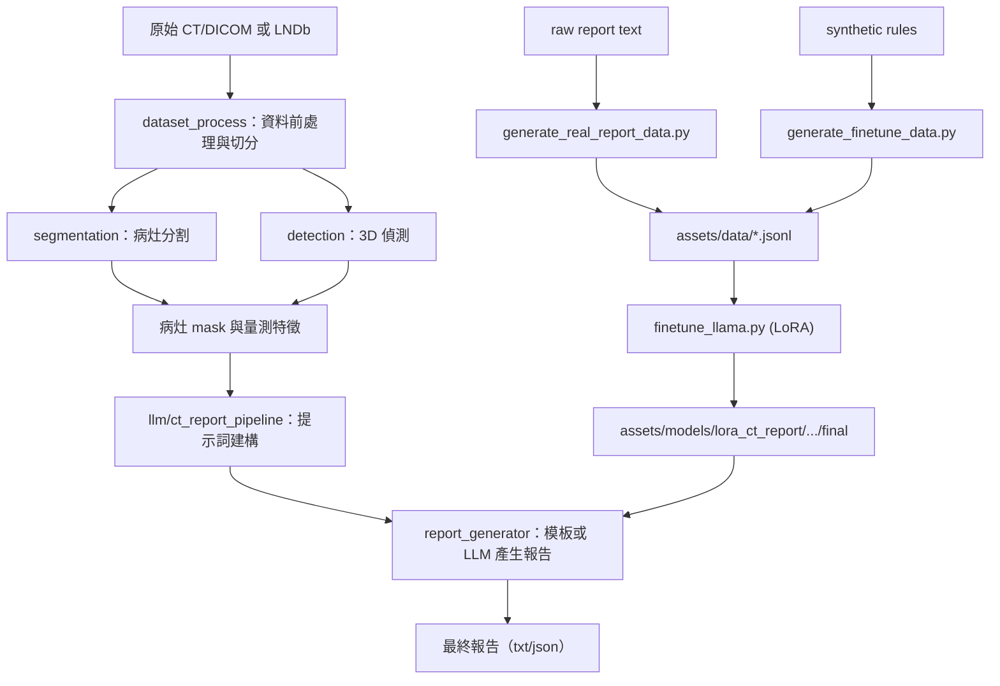

# 胸部 CT 報告生成專案 Pipeline（繁體中文版）

本文件說明 `C:\GitHub\chest-ct-report-generator` 的整體流程，包含主專案模組與已整合的 `llm/ct_report_pipeline`。

## 1. 專案目標

此專案目標是將胸部 CT 影像轉成可用於臨床判讀的結構化報告，核心能力包含：
- 結節分割（UNet++ / MedSAM2）
- 結節偵測（3D U-Net）
- 特徵量化（直徑、體積、HU 等）
- LLM 報告生成（模板 / Llama + LoRA）
- 訓練資料建置與微調流程

## 2. 整體架構



## 3. 主要目錄與職責

- `dataset_process/`
  - DICOM 前處理、資料分析、資料切分、可視化
- `segmentation/`
  - 結節分割（UNet++、MedSAM2、微調流程）
- `detection/`
  - 3D U-Net 結節偵測流程
- `llm/`
  - RAG 與 LLM 相關實驗
- `llm/ct_report_pipeline/`
  - 目前主要報告 pipeline（分割互動、特徵擷取、報告生成、LoRA 微調）

## 4. `ct_report_pipeline` 目前結構（已整理）

- 核心執行
  - `config/`
  - `segmentation/`
  - `features/`
  - `scripts/`
  - `report_generator.py`
  - `prompt_templates.py`
  - `quick_start.py`
- 訓練與模型資產
  - `assets/data/`
  - `assets/models/`
- 補充模組
  - `extras/dataset_process/`
  - `extras/evaluation/`
  - `extras/tests/`

## 5. 端到端執行流程（建議順序）

### Stage 0：環境與設定檢查

1. 使用專案虛擬環境：
```bash
venv\Scripts\python.exe
```

2. 檢查設定：
```bash
venv\Scripts\python.exe llm\ct_report_pipeline\quick_start.py
```

3. 主要設定檔：
- `llm/ct_report_pipeline/config/config.yaml`
- `llm/ct_report_pipeline/config/pipeline_config.yaml`

### Stage 1：資料準備（LNDb -> 中介 JSON）

```bash
venv\Scripts\python.exe llm\ct_report_pipeline\scripts\prepare_dataset.py
```

輸入：LNDb 影像、CSV 標註、mask  
輸出：`processed_data/dataset.json`（依 config）

### Stage 2：互動式分割與特徵萃取

```bash
venv\Scripts\python.exe llm\ct_report_pipeline\scripts\interactive_segmentation.py
```

流程：
1. 載入 CT（`.mhd/.nii/.nii.gz`）
2. 點擊前景/背景 prompt
3. 呼叫 MedSAM2 分割
4. 萃取各結節特徵（ESD、體積、HU、長短軸等）

### Stage 3：報告生成

由 `report_generator.py` 負責：
- `ReportGenerator`：LLM 生成
- `SimpleReportGenerator`：模板回退
- `get_report_generator(use_llm=True)` 會讀取 config 並自動套用 LoRA（若路徑存在）

### Stage 4：建立 LLM 微調資料

合成資料：
```bash
venv\Scripts\python.exe llm\ct_report_pipeline\scripts\generate_finetune_data.py
```

真實報告資料：
```bash
venv\Scripts\python.exe llm\ct_report_pipeline\scripts\generate_real_report_data.py --max_reports 200
```

輸出：`llm/ct_report_pipeline/assets/data/*.jsonl`

### Stage 5：LoRA 微調

```bash
venv\Scripts\python.exe llm\ct_report_pipeline\scripts\finetune_llama.py --epochs 3 --batch_size 1
```

輸出：
- `llm/ct_report_pipeline/assets/models/lora_ct_report/lora_<timestamp>/final`

完成後更新：
- `config.yaml` 中 `llm.lora_weights.latest`

### Stage 6：推論與輸出

- UI 路徑：`interactive_segmentation.py` 勾選「Use Llama LLM」
- 程式路徑：呼叫 `get_report_generator()` + 傳入 `lesion_features`

輸出格式：
- 主要：`txt/json`
- 備註：目前 `xml` 欄位在現行程式中仍為空

## 6. 一鍵常用指令清單

```bash
# 設定檢查
venv\Scripts\python.exe llm\ct_report_pipeline\quick_start.py

# 資料準備
venv\Scripts\python.exe llm\ct_report_pipeline\scripts\prepare_dataset.py

# 產生微調資料
venv\Scripts\python.exe llm\ct_report_pipeline\scripts\generate_finetune_data.py
venv\Scripts\python.exe llm\ct_report_pipeline\scripts\generate_real_report_data.py --max_reports 200

# 微調
venv\Scripts\python.exe llm\ct_report_pipeline\scripts\finetune_llama.py --epochs 3 --batch_size 1

# 互動分割與報告
venv\Scripts\python.exe llm\ct_report_pipeline\scripts\interactive_segmentation.py
```

## 7. 目前實務注意事項

- 請固定使用：`C:\GitHub\chest-ct-report-generator\venv\Scripts\python.exe`
- `quick_start.py` 已改為 ASCII 輸出，避免 Windows cp950 編碼錯誤
- `config/config.yaml` 已整理為可正常解析的 UTF-8
- 若 `quick_start.py` 顯示 `[MISSING]`，請先補齊：
  - LNDb 路徑
  - MedSAM2 目錄與 checkpoint
  - outputs/processed_data 目錄（可手動建立）

## 8. 最短可跑通路徑（Happy Path）

1. 設定 `config.yaml` 中 LNDb、MedSAM2、LoRA 路徑
2. 執行 `quick_start.py`，確認必要路徑可用
3. 啟動 `interactive_segmentation.py`
4. 載入 CT -> 點選 prompt -> 跑 segmentation
5. 生成報告（先模板，再切 LLM）
6. 儲存報告結果

