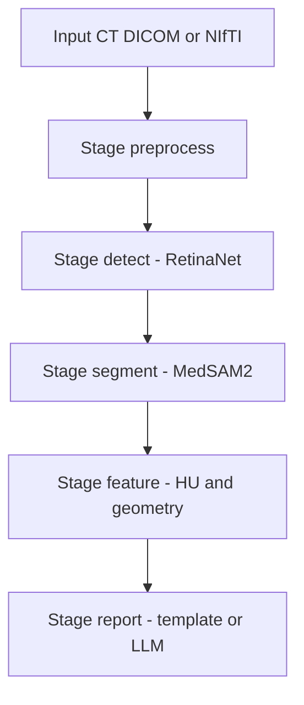

# 胸部 CT 報告生成 Pipeline（繁中）

本文描述目前專案的有效流程與模組責任。

## 1. 核心目標

- 結節偵測（RetinaNet + FPR）
- 結節分割（MedSAM2）
- 特徵量化（大小、體積、HU）
- 結構化報告生成（模板或 LLM）

## 2. 端到端流程



## 3. 主要目錄

- `detection/retinanet/`: 主偵測流程（含 FPR）
- `detection/common/`: 偵測共用工具
- `llm/ct_report_pipeline/`: 分割/特徵/報告模組
- `n8n/`: headless pipeline runner
- `dataset_process/`: 精簡後僅保留 manifest 輔助腳本

## 4. 建議執行順序

### Stage A: 準備偵測資料

```bash
python -m detection.retinanet.prepare_data --dataset lndb --base_dir "cache/LNDb" --output "detection/manifests/dataset_lndb.json"
```

### Stage B: 訓練與測試 RetinaNet

```bash
python -m detection.retinanet.main train --data_path "detection/manifests/dataset_lndb.json" --epochs 300 --output_dir "results/experiment_1"
python -m detection.retinanet.main test --data_path "detection/manifests/dataset_lndb.json" --output_dir "results/experiment_1"
```

### Stage C: 個案推論

```bash
python -m detection.retinanet.inference --input_path <CT_PATH> --model_path <MODEL_PATH> --output_dir <OUT_DIR>
```

### Stage D: 一鍵跑完整報告流程

```bash
python n8n/run_case_pipeline.py --stage run --case-id case001 --input-path <CT_PATH> --model-path <MODEL_PATH>
```

## 5. 目前已淘汰路徑

- `detection/train_3dunet/`（已移除）
- `detection/scripts/`（已移除）

## 6. 資料與輸出目錄說明

以下資料夾保留，不視為要刪除的程式碼：

- `detection/nndet_data/`
- `detection/results/`
- `detection/video_result/`
