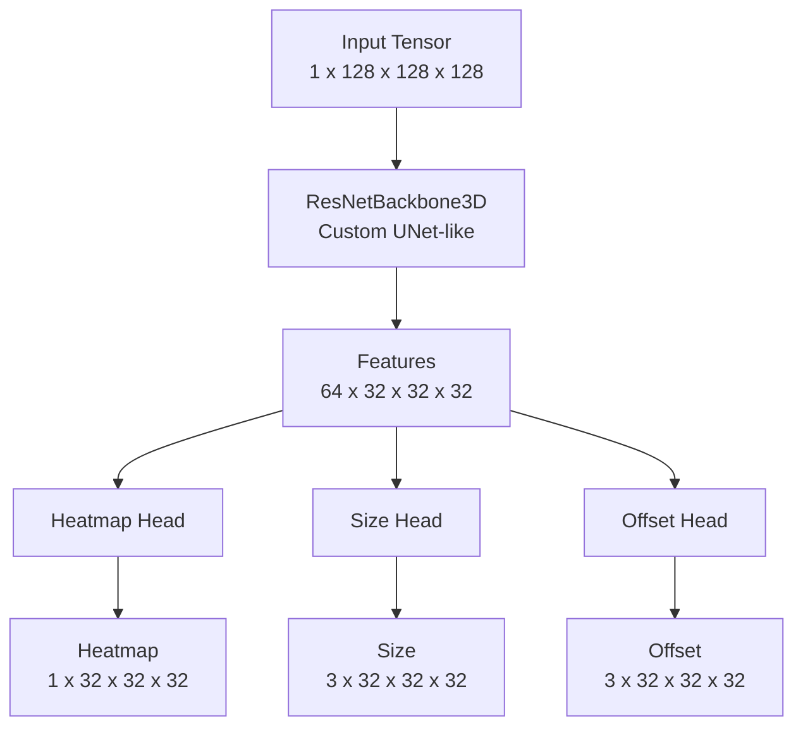

# DeepLung 3D CenterNet Pipeline 技術文件

> **DeepLung 3D**: 基於 Anchor-Free CenterNet 的 3D 肺結節偵測系統完整說明文件。

本文件詳細描述了 `detection/deep_lung` 模組的資料處理流、模型架構、訓練策略與評估指標。

---

## 📁 模組結構概覽

| 檔案 | 用途 | 關鍵函數/類別 |
|------|------|---------------|
| `preprocess.py` | **ETL**: DICOM/LNDb → 正規化 NPZ | `DeepLungPreprocessor`, `process_patient` |
| `dataset.py` | **Loader**: 隨機裁切 (128³)、3D 增強 | `LungNodule3DDataset` (Crop 50% on Nodule) |
| `model.py` | **Model**: CenterNet 3D + ResNet Backbone | `CenterNet3D`, `ResNetBackbone3D` |
| `train.py` | **Train**: 訓練迴圈與訓練策略 | `train_one_epoch`, `AdamW`, `CosineAnnealingLR` |
| `evaluate.py` | **Eval**: FROC 與 AP 評估 | `compute_froc`, `compute_map` |

---

## 1. 資料前處理 (`preprocess.py`)

前處理將非結構化的 DICOM 或 LNDb 原始資料標準化為模型可讀的 `.npz` 格式。

### 1.1 處理流程
1. **讀取 (IO)**: 使用 `SimpleITK` 讀取 DICOM Series 或 MHD 檔案，確保 Z 軸順序正確。
2. **重取樣 (Resample)**: 所有影像統一重取樣至 **1.0 × 1.0 × 1.0 mm** 等向解析度 (Isotropic Resolution)。
3. **正規化 (Normalization)**:
   - **Intensity Clipping**: 裁切 HU 值範圍至 `[-1000, 400]` (肺窗)。
   - **Min-Max Scaling**: 映射至 `[0, 1]` 區間。
4. **標註處理 (Annotation)**:
   - 解析 XML (Generic) 或 CSV (LNDb)。
   - 將結節座標從「物理空間 (mm)」轉換為「重取樣後的體素座標 (voxel index)」。
5. **儲存**: 輸出為 `.npz` 檔案，包含 `image` (D, H, W) 與 `boxes` (N, 6)。

### 1.2 輸出格式
- **Image**: `float32`, shape `(Total_Z, Y, X)`, range `[0, 1]`.
- **Boxes**: `float32`, shape `(N, 6)`.
  - 格式: `[z_center, y_center, x_center, depth, height, width]` (Center-Size)

---

## 2. 資料集與增強 (`dataset.py`)

處理訓練時的即時資料供給，核心在於 3D 隨機裁切與增強。

### 2.1 Patch-based Training
由於全肺 CT 體積過大 (約 400×512×512)，無法直接放入 GPU 訓練，因此採用 **Patch** 策略：
- **Crop Size**: `128 × 128 × 128`
- **取樣策略**:
  - **50% 機率**: 強制以某個肺結節為中心進行裁切（確保模型看過足夠多的正樣本）。
  - **50% 機率**: 對影像進行隨機裁切（學習背景與負樣本）。

### 2.2 3D 資料增強 (On-the-fly)
訓練時每次讀取會隨機套用以下增強，增加模型泛化能力：
| 增強方法 |機率 | 描述 |
|----------|-----|------|
| **Flip** | 50% | 隨機沿 Z, Y, X 軸翻轉 |
| **Rotate90** | 50% | 在 Axial 平面 (YX) 隨機旋轉 90°, 180°, 270° |
| **Intensity Jitter** | 50% | 亮度縮放 (0.8~1.2x) 與 平移 (±0.1) |
| **Gaussian Noise** | 30% | 加入隨機高斯雜訊 ($\sigma \in [0.01, 0.05]$) |
| **Gaussian Blur** | 20% | 高斯模糊 ($\sigma \in [0.3, 1.0]$)，模擬不同解析度 |
| **Gamma** | 30% | Gamma 校正 ($\gamma \in [0.8, 1.2]$) |

### 2.3 座標轉換
- **Dataset 輸出**: 將 Box 轉換為 **Corner Format** `[x1, y1, z1, x2, y2, z2]` 以符合 Detectron/R-CNN 慣例。
- **注意**: 座標軸序從 (Z, Y, X) 轉為 (X, Y, Z)。

---

## 3. 模型架構 (`model.py`)

使用 **CenterNet 3D** (Objects as Points) 架構。Anchor-Free 設計避免了 Anchor 設計與匹配的複雜度，對小結節偵測更友善。

### 3.1 網路層次


### 3.2 詳細配置
1. **Backbone (Encoder-Decoder)**:
   - **Encoder**: 類似 ResNet，下採樣 3 次 (stride=8)。
   - **Decoder**: 上採樣 1 次並與 Encoder 特徵拼接 (Skip Connection)。
   - **Output Stride**: **4** (輸入 128 → 輸出 32)，保留足夠空間解析度。
   
2. **Heads (Detection Branches)**:
   - **Heatmap**: `1 channel`. 預測結節中心機率 (Sigmoid)。
   - **Size**: `3 channels`. 預測結節的 (dx, dy, dz) 尺寸。
   - **Offset**: `3 channels`. 預測子體素 (Sub-voxel) 偏移量，修正 stride=4 帶來的量化誤差。

---

## 4. 訓練策略 (`train.py`)

### 4.1 Loss Function
總 Loss 為三個分支的加權和：
$$ L_{total} = L_{heatmap} + \lambda_{size} L_{size} + \lambda_{off} L_{offset} $$
其中 $\lambda_{size}=0.1, \lambda_{off}=0.1$。

1. **Heatmap Loss**: **Focal Loss** (Modified for CenterNet)
   - 處理正負樣本極度不平衡 (背景遠多於結節)。
   - $\alpha=2, \beta=4$。
   - Target 使用高斯核 (Gaussian Kernel) 渲染，容許中心附近的預測。
   
2. **Size / Offset Loss**: **L1 Loss**
   - 僅在 Ground Truth 中心點位置計算 Loss。

### 4.2 Hyperparameters
- **Optimizer**: `AdamW` (Weight Decay 1e-4)
- **Learning Rate**: `1e-4`
- **Scheduler**: `CosineAnnealingLR` (T_max=100)
- **Epochs**: 100
- **Batch Size**: 2 (受限於 VRAM，因 128³ volume 較大)

---

## 5. 推論與評估 (`decode_detections` & `evaluate.py`)

### 5.1 推論流程
1. **Heatmap Peak Finding**: 使用 3x3x3 Max Pooling 尋找局部極大值 (替代 NMS)。
2. **Thresholding**: 取 Score > 0.1 的點。
3. **Top-K**: 每個樣本最多保留前 100 個高分框。
4. **Decode**: 
   $$ Center = (Index + Offset) \times Stride $$
   $$ Box = Center \pm Size/2 $$

### 5.2 評估指標
- **LUNA16 FROC**: 醫療影像標準指標。計算在平均每次掃描不同 FP (0.125, 0.25, ..., 8) 下的 Sensitivity。
- **YOLO-style Metrics**:
  - **IoU Threshold**: **0.1** (結節較小，且重疊即可視為偵測到，這是醫療偵測慣例)。
  - **AP (Average Precision)**
  - **F1-Score**

---

## 6. 使用指南 (Quick Start)

### 步驟 1: 資料預處理
支援 LNDb 資料集或一般 DICOM 資料夾。
```bash
# 處理 LNDb
python -m detection.deep_lung.preprocess \
    --data_root /path/to/LNDb \
    --dataset_type lndb \
    --output_dir cache/deep_lung_cache

# 或處理一般 DICOM (需搭配 XML)
python -m detection.deep_lung.preprocess \
    --data_root /path/to/dicom_folder \
    --output_dir cache/deep_lung_cache
```

### 步驟 2: 訓練
```bash
python -m detection.deep_lung.train
```
結果會儲存在 `detection/result/deep_lung_YYYYMMDD_HHMMSS/`。

### 步驟 3: 評估 (單獨執行)
```bash
python -m detection.deep_lung.evaluate \
    --checkpoint detection/result/deep_lung_xxx/deep_lung_epoch_100.pth \
    --data_dir cache/deep_lung_cache/test
```
