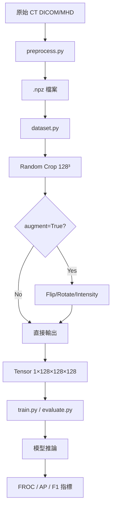

# DeepLung 3D Faster R-CNN 技術文件

> 完整的前處理、增強、訓練/驗證/測試方法說明

---

## 📁 模組結構

| 檔案 | 功能 |
|------|------|
| `preprocess.py` | 原始 DICOM/MHD → NPZ 預處理 |
| `dataset.py` | PyTorch Dataset (Crop + Augment) |
| `model.py` | 3D Faster R-CNN 模型架構 |
| `train.py` | 訓練迴圈 |
| `evaluate.py` | FROC / AP / F1 評估 |
| `visualize.py` | 訓練曲線、混淆矩陣、樣本可視化 |

---

## 1. 前處理 (`preprocess.py`)

### 支援格式
- **LNDb**: `.mhd` + `trainNodules_gt.csv`
- **Generic**: DICOM 資料夾 + XML 標註

### 處理流程

```
原始 CT (HU) 
    ↓
1. 載入 (SimpleITK)
    ↓
2. Resample 到 1×1×1 mm (三線性插值)
    ↓
3. HU 裁切 (min=-1000, max=400)
    ↓
4. Min-Max 正規化 → [0, 1]
    ↓
5. 標註座標轉換 (物理座標 → 體素索引)
    ↓
6. 存成 .npz {'image': (D,H,W), 'boxes': (N,6)}
```

### 標註格式 (Center-Size)
```python
boxes = [z_center, y_center, x_center, depth, height, width]
```

### 資料分割
| Split | 比例 |
|-------|------|
| Train | 70% |
| Val | 15% |
| Test | 15% |

---

## 2. 資料增強 (`dataset.py`)

### `LungNodule3DDataset` 使用方式

```python
dataset = LungNodule3DDataset(
    data_dir="cache/deep_lung_cache/train",
    split="train",
    augment=True,           # 是否啟用增強
    crop_size=(128,128,128) # 固定裁切尺寸
)
```

### 資料處理流程

```
載入 .npz
    ↓
1. Random Crop (128³)
   - 50% 以結節為中心
   - 50% 完全隨機
    ↓
2. Data Augmentation (if augment=True)
    ↓
3. 座標格式轉換 (Center → Corner)
    ↓
4. 轉 Tensor
```

### 增強操作詳情

| 增強類型 | 機率 | 操作 |
|---------|------|------|
| Flip Z | 50% | `np.flip(axis=0)` |
| Flip Y | 50% | `np.flip(axis=1)` |
| Flip X | 50% | `np.flip(axis=2)` |
| Rotate 90° | 50% | `np.rot90(k∈{1,2,3})` |
| Intensity Jitter | 50% | `img * scale + shift` |

> **座標同步**: 翻轉/旋轉時 Bounding Box 座標會同步更新

---

## 3. 訓練 (`train.py`)

### 超參數

```python
BATCH_SIZE = 2
LR = 1e-5
EPOCHS = 50
EVAL_INTERVAL = 1
```

### 損失函數

模型返回 4 個 Loss 組件：
```python
losses = {
    'loss_rpn_cls',   # RPN 前景/背景分類
    'loss_rpn_box',   # RPN 框回歸
    'loss_classifier', # RoI 分類
    'loss_box_reg'    # RoI 框回歸
}
```

### 穩定性措施
- 梯度裁剪: `max_norm=1.0`
- NaN Loss 跳過
- 低學習率: `1e-5`

### 輸出檔案

所有結果存至 `detection/result/deep_lung_{timestamp}/`：
- `metrics.txt`: 逐 Epoch 指標
- `curve_*.png`: 訓練曲線
- `confusion_matrix_epoch_*.png`: 混淆矩陣
- `vis_epoch_*/`: 樣本可視化
- `deep_lung_epoch_*.pth`: 模型權重

---

## 4. 驗證指標

### LUNA16 標準 (FROC)

| FP/Scan | 說明 |
|---------|------|
| 0.125 | 極低假陽性 |
| 0.25 | |
| 0.5 | |
| 1 | 常用基準 |
| 2 | |
| 4 | |
| 8 | 高假陽性容忍 |

**Average FROC Score** = 7 個點的 Sensitivity 平均

### YOLO 風格指標

| 指標 | 公式 |
|------|------|
| Precision | TP / (TP + FP) |
| Recall | TP / GT |
| F1-Score | 2 × Prec × Rec / (Prec + Rec) |
| AP@0.1 | PR Curve 面積 (IoU=0.1) |

---

## 5. 測試 (`evaluate.py`)

### 執行命令

```bash
python -m detection.deep_lung.evaluate \
    --checkpoint models/best.pth \
    --data_dir cache/deep_lung_cache/test
```

### 匹配邏輯

```
1. 按 score 排序所有 detections
2. 對每個 detection:
   - 計算與所有 GT 的 3D IoU
   - 若最高 IoU ≥ 0.1 且 GT 未被匹配 → TP
   - 否則 → FP
3. 未被匹配的 GT → FN
```

---

## 📊 完整資料流程



---

## 🔧 快速開始

```bash
# 1. 預處理 LNDb 資料集
python -m detection.deep_lung.preprocess \
    --data_root datasets/LNDb \
    --dataset_type lndb

# 2. 訓練
python -m detection.deep_lung.train

# 3. 測試
python -m detection.deep_lung.evaluate \
    --checkpoint detection/result/deep_lung_xxx/deep_lung_epoch_50.pth

# 4. 視覺化訓練輸入
python -m detection.deep_lung.visualize_ct_3d
```
