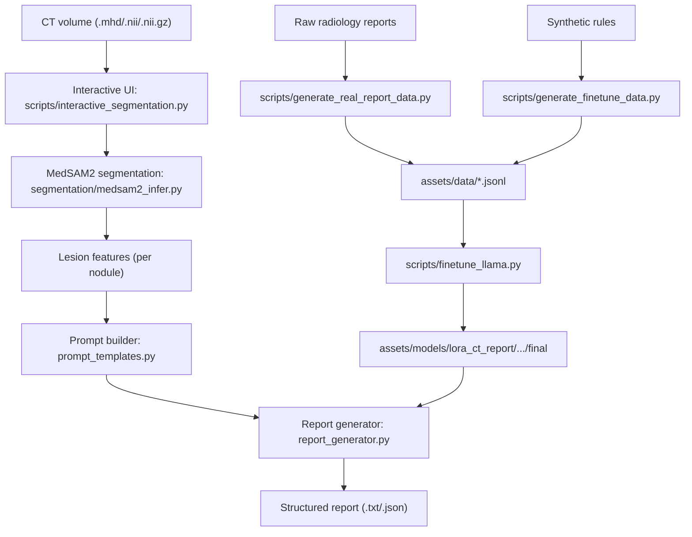

# Chest CT Report Pipeline Document

This document describes the end-to-end pipeline under `llm/ct_report_pipeline` after integration and reorganization.

## 1. Pipeline goal

The pipeline turns chest CT nodule information into structured radiology reports.

Core capabilities:
- Interactive lesion segmentation (MedSAM2, point prompts)
- Nodule feature extraction (size, volume, HU, axes)
- Report generation (template-based or Llama + LoRA)
- LLM fine-tuning data generation (synthetic + real reports)
- LoRA fine-tuning for report generation

## 2. High-level data flow



## 3. Current project layout

- Core runtime
  - `config/`
  - `segmentation/`
  - `features/`
  - `scripts/`
  - `report_generator.py`
  - `prompt_templates.py`
  - `quick_start.py`
- Training and model artifacts
  - `assets/data/`
  - `assets/models/`
- Optional/auxiliary modules
  - `extras/dataset_process/`
  - `extras/evaluation/`
  - `extras/tests/`

## 4. Stage-by-stage pipeline

### Stage 0: Environment and config

Main config files:
- `config/config.yaml` (full pipeline config)
- `config/pipeline_config.yaml` (LLM training focused)

Main runtime path keys:
- LNDb root: `datasets.lndb.root`
- MedSAM2 root/checkpoint: `medsam2.root`, `medsam2.checkpoints.*`
- LoRA path: `llm.lora_weights.latest`
- Training data path: `outputs.training_data` -> `assets/data`

Sanity check:
```bash
venv\Scripts\python.exe llm\ct_report_pipeline\quick_start.py
```

### Stage 1: Dataset preparation (LNDb -> intermediate JSON)

Script:
- `scripts/prepare_dataset.py`

What it does:
- Reads LNDb CT and CSV annotations
- Locates radiologist masks (`*_rad*.mhd`)
- Creates intermediate scan-level JSON entries

Input:
- LNDb folder (default from config)

Output:
- `processed_data/dataset.json` (default path from config)
- Per-scan metadata with `regions[]` and `global_report_gt`

Run:
```bash
venv\Scripts\python.exe llm\ct_report_pipeline\scripts\prepare_dataset.py
```

### Stage 2: Interactive segmentation + feature extraction

Script:
- `scripts/interactive_segmentation.py`

Flow:
1. Load CT volume
2. Click foreground/background prompts per nodule
3. Run MedSAM2 segmentation (`MedSAM2Segmenter.segment_from_points`)
4. Extract per-nodule measurements from mask and CT intensity
5. Generate report from extracted features

Key extracted fields per nodule:
- `equivalent_diameter_mm`
- `volume_mm3`
- `mean_hu`, `min_hu`, `max_hu`
- `longest_axis_mm`, `short_axis_mm`
- `bbox`, `center_mm`, `spacing_mm`

Run:
```bash
venv\Scripts\python.exe llm\ct_report_pipeline\scripts\interactive_segmentation.py
```

Optional startup CT:
```bash
venv\Scripts\python.exe llm\ct_report_pipeline\scripts\interactive_segmentation.py --ct_path <path_to_ct>
```

### Stage 3: Report generation

Core module:
- `report_generator.py`

Modes:
- LLM mode: `ReportGenerator`
- Fallback mode: `SimpleReportGenerator` (rule/template based)

Factory:
- `get_report_generator(use_llm=True)`
- Auto-loads model settings from `config/config.yaml`
- Uses LoRA automatically when `llm.lora_weights.latest` exists

Prompt construction:
- `prompt_templates.py`
- Converts lesion features into nodule descriptions
- Enforces Lung-RADS style output template

### Stage 4: Fine-tuning data generation

Synthetic training pairs:
- `scripts/generate_finetune_data.py`
- Produces `assets/data/finetune_train.jsonl` and `assets/data/finetune_val.jsonl`

Real-report derived training pairs:
- `scripts/generate_real_report_data.py`
- Reads source reports from `reports.raw_reports`
- Writes JSONL to `reports.processed_reports`

Run:
```bash
venv\Scripts\python.exe llm\ct_report_pipeline\scripts\generate_finetune_data.py
venv\Scripts\python.exe llm\ct_report_pipeline\scripts\generate_real_report_data.py --max_reports 200
```

### Stage 5: LLM LoRA fine-tuning

Script:
- `scripts/finetune_llama.py`

Default data/model paths:
- Train: `assets/data/finetune_train.jsonl`
- Val: `assets/data/finetune_val.jsonl`
- Output: `assets/models/lora_ct_report/lora_<timestamp>/final`

Run:
```bash
venv\Scripts\python.exe llm\ct_report_pipeline\scripts\finetune_llama.py --epochs 3 --batch_size 1
```

After training:
- Update LoRA path in `config/config.yaml` -> `llm.lora_weights.latest`

### Stage 6: Inference with fine-tuned model

Two practical paths:
- UI path: `interactive_segmentation.py` with "Use Llama LLM" enabled
- Programmatic path: call `get_report_generator(use_llm=True)` and pass lesion features

Expected output:
- Text report (always)
- JSON report metadata (if saved)
- XML field currently remains empty (`None`) in generator output

### Stage 7 (optional): MedSAM2 fine-tuning

Module:
- `segmentation/finetune_medsam2/`

Purpose:
- Improve segmentation quality on local dataset

Then update checkpoint in config:
- `medsam2.checkpoints.finetuned`
- `medsam2.default_checkpoint`

## 5. Primary command cookbook

```bash
# 1) Config check
venv\Scripts\python.exe llm\ct_report_pipeline\quick_start.py

# 2) Prepare LNDb intermediate dataset
venv\Scripts\python.exe llm\ct_report_pipeline\scripts\prepare_dataset.py

# 3) Generate synthetic fine-tune data
venv\Scripts\python.exe llm\ct_report_pipeline\scripts\generate_finetune_data.py

# 4) Generate real-report fine-tune data
venv\Scripts\python.exe llm\ct_report_pipeline\scripts\generate_real_report_data.py --max_reports 200

# 5) Fine-tune Llama with LoRA
venv\Scripts\python.exe llm\ct_report_pipeline\scripts\finetune_llama.py --epochs 3 --batch_size 1

# 6) Run interactive segmentation + report generation UI
venv\Scripts\python.exe llm\ct_report_pipeline\scripts\interactive_segmentation.py
```

## 6. Inputs and outputs by stage

- CT input
  - Input: `.mhd` / `.nii` / `.nii.gz`
  - Output: nodule masks + nodule feature dict list
- Data preparation
  - Input: LNDb folders + CSV + masks
  - Output: `processed_data/dataset.json`
- Fine-tune data generation
  - Input: synthetic rules and/or raw reports
  - Output: `assets/data/*.jsonl`
- LLM fine-tuning
  - Input: JSONL pairs
  - Output: `assets/models/lora_ct_report/lora_<timestamp>/final`
- Report generation
  - Input: lesion features list
  - Output: radiology report text (+ optional json save)

## 7. Known operational notes

- Use project venv interpreter for all commands:
  - `C:\GitHub\chest-ct-report-generator\venv\Scripts\python.exe`
- `quick_start.py` is now ASCII-safe for Windows cp950 terminals.
- `config/config.yaml` has been normalized to UTF-8 for reliable YAML loading.
- `report_generator.save_report()` currently saves `txt/json`; XML field is not generated by current pipeline.

## 8. Minimal end-to-end happy path

1. Fill paths in `config/config.yaml` (LNDb, MedSAM2 checkpoint, LoRA path).
2. Run `quick_start.py` and confirm required paths are `[OK]`.
3. Launch `interactive_segmentation.py`.
4. Load CT, click prompts, run segmentation.
5. Generate report (template mode first; then LLM mode after model readiness).
6. Save report artifacts.

