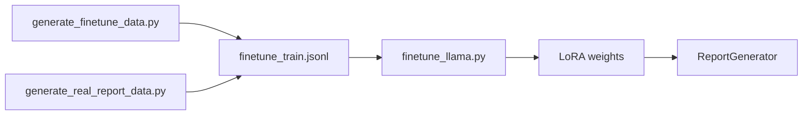

# CT Report Pipeline

銝€?垢?啁垢??? CT ?賊?勗???蝟餌絞嚗??楛摨血飛蝧??脫芋??MedSAM2嚗? LLM ?勗???嚗??**Lung-RADS 2022** ??閰摯??

## ??寡

- ? **鈭?撘???* - ?箸 MedSAM2 ????蝯??嚗蝙?券???蝷?
- ?? **憭?蝭€?舀** - 瘥€??遣蝡蝡?蝭€嚗??仿€脰???
- ? **蝎曄Ⅱ皜祇?** - ?箸???敺?蝞?Feret ?游??????游? ESD?CA 頠賂?
- ?? **LLM ?勗???** - ?箸 Llama ??CT ?勗???嚗??LoRA 敺株矽
- ? **Lung-RADS 2022** - ?芸??脰? Lung-RADS ???恣?遣霅?
- ?? **閰摯??** - ?舀 BLEU?ETEOR?ormat Compliance 閰摯

---

## 撠?蝯?

```
ct_report_pipeline/
???€ config/                           # ?蔭璅∠?
??  ???€ config_loader.py              # ?蔭頛??
??  ???€ pipeline_config.yaml          # 銝餉??蔭瑼?
??
???€ data/                             # 閮毀鞈?
??  ???€ finetune_train.jsonl          # LLM 閮毀鞈?
??  ???€ finetune_val.jsonl            # LLM 撽?鞈?
??  ???€ finetune_combined.jsonl       # ?蔥閮毀鞈?
??
???€ evaluation/                       # 閰摯璅∠?
??  ???€ metrics.py                    # BLEU?ETEOR?撘?隡唳?璅?
??
???€ features/                         # ?孵噩??璅∠?
??  ???€ extractor.py                  # 蝯??孵噩????
??
???€ llm/                              # LLM ?勗???璅∠?
??  ???€ prompt_templates.py           # ?內璅⊥嚗 Lung-RADS嚗?
??  ???€ report_generator.py           # ?勗????剁?LLM ?芋?踹?嚗?
??
???€ models/                           # 璅∪?甈?
??  ???€ lora_ct_report/               # LLM LoRA 敺株矽甈?
??
???€ scripts/                          # ?瑁??單
??  ???€ interactive_segmentation.py   # 銝餉? GUI ?蝔?
??  ???€ finetune_llama.py             # LLM LoRA 敺株矽
??  ???€ generate_finetune_data.py     # ??璅⊥閮毀鞈?
??  ???€ generate_real_report_data.py  # 敺?撖血??????
??  ???€ prepare_dataset.py            # 鞈?????
??  ???€ measure_gt_mask.py            # Ground Truth 皜祇?撌亙
??
???€ segmentation/                     # ?璅∠?
??  ???€ MedSAM2/                      # MedSAM2 璅∪?摨?
??  ???€ medsam2_infer.py              # MedSAM2 ?刻??單
??  ???€ finetune_medsam2/             # MedSAM2 敺株矽璅∠?
??
???€ tests/                            # 皜祈岫璅∠?
??  ???€ test_pipeline.py              # 蝞⊿?皜祈岫
??
???€ quick_start.py                    # 敹恍€?憪??
???€ requirements.txt                  # ?訾?憟辣
???€ .env.example                      # ?啣?霈蝭?
```

---

## 摰?

### ?蔭?€瘙?
- Python 3.10+
- ?舀 CUDA ??GPU嚗遣霅???8GB VRAM嚗?
- Git

### 摰?甇仿?

```bash
# 銴ˊ撠?
git clone https://github.com/yourusername/ct_report_pipeline.git
cd ct_report_pipeline

# 撱箇???啣?
python -m venv venv
venv\Scripts\activate  # Windows
# source venv/bin/activate  # Linux/Mac

# 摰? PyTorch嚗??CUDA ?嚗?
pip install torch torchvision --index-url https://download.pytorch.org/whl/cu121

# 摰??訾?憟辣
pip install -r requirements.txt

# 閮剖??啣?霈
copy .env.example .env
# 蝺刻摩 .env ??函? HUGGINGFACE_TOKEN
```

### 鞈?皞?

#### 1. 銝? MedSAM2 璅∪?

```bash
# Clone MedSAM2 ??segmentation/ ?桅?
cd segmentation
git clone https://github.com/bowang-lab/MedSAM2.git MedSAM2

# ?賊? 2: CT 撠甈?嚗???敺株矽璅∪?嚗?
# 銴ˊ?函?敺株矽甈???segmentation/MedSAM2_best_model.pth
```

> [!TIP]
> MedSAM2 摰?澈嚗ttps://github.com/bowang-lab/MedSAM2

#### 2. 銝? LNDb 鞈???

LNDb (Lung Nodule Database) ? 294 ??CT ??嚗???LIDC-IDRI ???券?霅???嚗?潸蝯? CAD 蝟餌絞???

**銝????嚗?* [LNDb - Zenodo](https://zenodo.org/records/8348419)

> [!IMPORTANT]
> **??璇狡嚗?* CC BY-NC-ND嚗?撘嚗?
> 
> 雿輻甇方???隢??剁?
> - Pedrosa, J. et al. "LNDb: a lung nodule database on computed tomography." arXiv:1911.08434 (2019)
> - Pedrosa, J. et al. "LNDb challenge on automatic lung cancer patient management." Medical Image Analysis 70 (2021)

銝?敺圾憯葬嚗遣霅啁?瑽?銝?

```
LNDb/
???€ data0/                  # CT ??鞈?
??  ???€ LNDb-0001.mhd
??  ???€ LNDb-0001.raw
??  ???€ ...
???€ trainset_csv/           # 璅酉 CSV 瑼?
??  ???€ trainset_metadata.csv
???€ masks/                  # 蝯??桃蔗
    ???€ LNDb-0001/
    ???€ ...
```

4. ?湔 `config/pipeline_config.yaml` 銝剔?頝臬?嚗?

```yaml
lndb_root: "C:/path/to/LNDb"
```

---

## 敹恍€?憪?

### 1. ?蔭撽?

```bash
python quick_start.py
```

### 2. 鈭?撘???UI

```bash
python scripts/interactive_segmentation.py
```

#### 雿輻?孵?嚗?
1. **頛 CT** - 暺??pen CT????CT ??瑼?.mhd, .nii, .nii.gz嚗?
2. **璅?蝯?** - ?函?蝭€銝???瘥活?暺? = ?啁?蝭€嚗?
3. **?瑁??** - 暺??un Segmentation???脫???閮?蝯?
4. **???勗?** - 暺??enerate Report???舫嚗???LLM 憓撥?勗?嚗?
5. **?脣?** - ?脣??桃蔗?敺蛛?JSON嚗??勗?嚗XT嚗?

---

## ?璅∪?

### MedSAM2嚗????嚗?

?箸 SAM2 ?摮詨蔣???脫芋???舀暺??內?脰?鈭?撘??脯€?

```bash
# 敺株矽 MedSAM2
cd segmentation/finetune_medsam2
python main.py --data_root <LNDB_PATH> --epochs 50
```

閰喟敦?辣隢???[segmentation/finetune_medsam2/README.md](segmentation/finetune_medsam2/README.md)

---

## LLM ?勗???

### Fine-Tune 瘚?



### 1. ??閮毀鞈?

```bash
# ??璅⊥閮毀鞈?嚗?蝔桃?蝭€憭批?/憿?蝯?嚗?
python scripts/generate_finetune_data.py

# 敺?撖血????蝺渲???
python scripts/generate_real_report_data.py --reports_dir <REPORTS_PATH>
```

### 2. ?瑁? LoRA 敺株矽

```bash
python scripts/finetune_llama.py --epochs 5 --batch_size 4
```

銝餉??嚗?
- `--model_name`: ?箇?璅∪?嚗?閮?`meta-llama/Llama-3.2-1B-Instruct`嚗?
- `--epochs`: 閮毀頛芣
- `--lora_r`: LoRA rank嚗?閮?16嚗?
- `--use_8bit`: ? 8-bit ??隞亦????園?

### 3. 閰摯??

閮毀摰?敺??蝞?

| ?? | 隤芣? |
|------|------|
| **eval_loss** | 撽??漱??仃 |
| **BLEU** | ??? n-gram ??摨?(0-1) |
| **METEOR** | ??儔閰???訾撮摨?(0-1) |
| **format_compliance** | ?勗??澆?蝚血?摨?(0-1) |

---

## Lung-RADS 2022 ??

| 憿 | 隤芣? | 撖血?蝯?憭批? | ?蔭撱箄降 |
|------|------|-------------|----------|
| 2 | ?舀€批?閫€ | < 6 mm | 撟游漲 LDCT |
| 3 | ?航?舀€?| 6 - < 8 mm | 6 ?? LDCT |
| 4A | ?舐? | 8 - < 15 mm | 3 ?? LDCT ??PET/CT |
| 4B | 擃漲?舐? | ??15 mm | PET/CT ??????瑼Ｘ |

---

## ?勗?頛詨蝭?

```
Report ID: AUTO_LNDb-0091
Date: 2025/12/20

Technique:
Non-contrast CT chest.

Findings:

Lungs:
1. A 6.4 mm solid pulmonary nodule with volume of 134.5 mm糧.

Mediastinum: No masses or lymphadenopathy.
Pleura: No effusion.

Lung-RADS Assessment:
Category: 3
Malignancy Risk: 1-2%

Impression:
1. 1 pulmonary nodule(s), largest 6.4 mm - Lung-RADS Category 3

Recommendation:
6-month LDCT follow-up.
```

---

## ?蔭閮剖?

蝺刻摩 `config/pipeline_config.yaml`嚗?

```yaml
segmentation_model: "medsam2"

medsam2:
  root: "path/to/MedSAM2"
  checkpoint: "path/to/MedSAM2_best_model.pth"

llm:
  model_name: "meta-llama/Llama-3.2-1B-Instruct"
  lora_path: "assets/models/lora_ct_report/lora_XXXXXX/final"
  temperature: 0.3

device: "cuda"
```

---

## ?訾?憟辣

**?詨? ML 憟辣嚗?*
- PyTorch >= 2.0
- Transformers >= 4.40
- PEFT >= 0.10
- Accelerate >= 0.27
- Datasets >= 2.14

**?怠飛敶勗???嚗?*
- SimpleITK >= 2.2
- nibabel >= 5.0
- OpenCV >= 4.8

**?詨€潸?蝞?**
- NumPy >= 1.24
- SciPy >= 1.10
- scikit-learn >= 1.3

**閰摯憟辣嚗?*
- NLTK >= 3.8 (BLEU/METEOR)

**閬死?? UI嚗?*
- Pillow >= 10.0
- matplotlib >= 3.7

**?蔭?極?瘀?**
- PyYAML >= 6.0
- tqdm >= 4.65
- Hydra >= 1.2
- python-dotenv >= 1.0

閰喟敦?隢???`requirements.txt`

---

## ??

MIT License

---

## ?渲?

- [MedSAM2](https://github.com/bowang-lab/MedSAM) - ?怠飛敶勗??
- [Llama](https://github.com/meta-llama/llama) - 憭批?隤?璅∪?
- [LNDb Dataset](https://lndb.grand-challenge.org/) - ?箇?蝭€鞈?摨?

