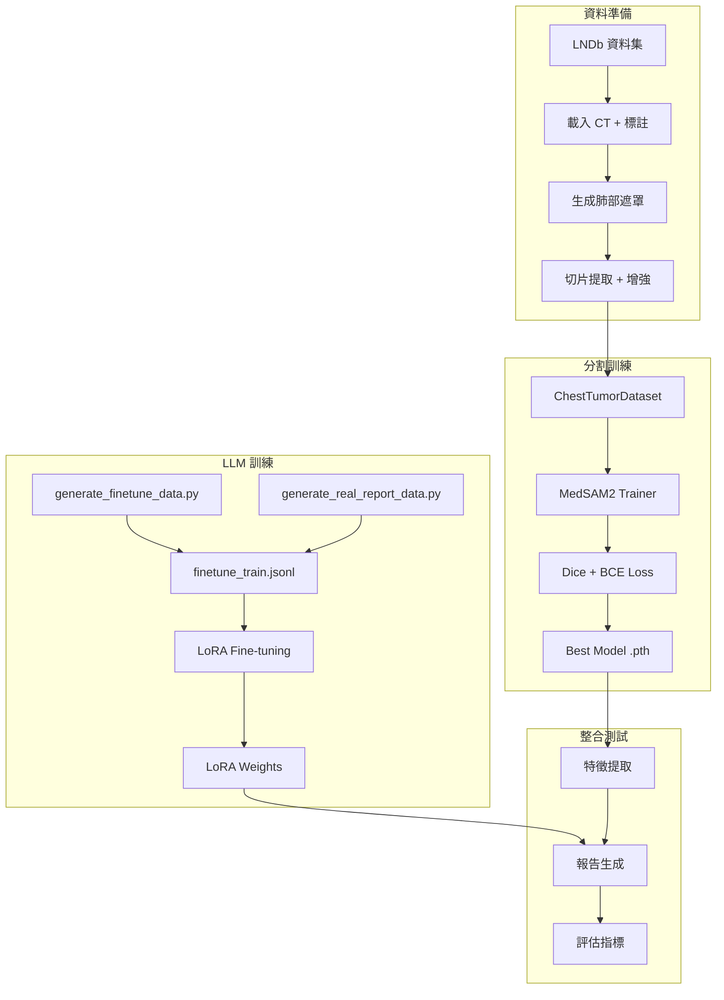
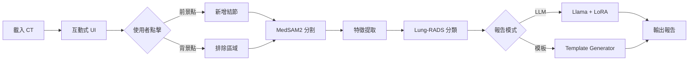

# CT Report Pipeline 專案完整說明文件

> **版本**: 1.1  
> **最後更新**: 2025-12-22  
> **專案類型**: 端到端自動化 CT 胸部報告生成系統

---

## 📋 目錄

1. [專案概述](#1-專案概述)
2. [系統架構](#2-系統架構)
3. [核心技術原理](#3-核心技術原理)
4. [資料集與前處理](#4-資料集與前處理)
5. [分割模組 (Segmentation)](#5-分割模組-segmentation)
6. [大型語言模型微調 (LLM Fine-Tuning)](#6-大型語言模型微調-llm-fine-tuning)
7. [評估指標系統](#7-評估指標系統)
8. [實驗結果](#8-實驗結果)
9. [完整工作流程](#9-完整工作流程)
10. [專案目錄結構詳解](#10-專案目錄結構詳解)
11. [安裝與設定指南](#11-安裝與設定指南)

---

## 1. 專案概述

### 1.1 專案目標

本專案建立一個**端到端的自動化 CT 胸部報告生成系統**，結合深度學習分割模型與大型語言模型，實現：

1. **自動結節分割** - 使用 MedSAM2 模型進行互動式/自動化肺結節分割
2. **量化特徵提取** - 計算結節的形態學、影像學特徵
3. **Lung-RADS 2022 評估** - 自動進行臨床風險分類
4. **專業報告生成** - 使用微調後的 LLM 生成標準化放射科報告

### 1.2 技術亮點

| 功能 | 技術實現 |
|------|----------|
| 🎯 互動式分割 | MedSAM2 + 點擊提示 (Point Prompts) |
| 📊 多結節支援 | 每個點擊建立獨立結節，分別分析 |
| 🔬 精確測量 | Feret 直徑、等效球直徑 (ESD)、PCA 主軸 |
| 📝 報告生成 | Llama-3.2 + LoRA 微調 |
| 🏥 臨床評估 | Lung-RADS 2022 自動分類 |

### 1.3 支援的資料集

- **LNDb (Lung Nodule Database)** - 推薦，具有專家標註的分割遮罩
- **MSD Lung Tumours** - Medical Segmentation Decathlon 肺腫瘤資料集
- **LUNA16** - 可選，用於額外訓練資料

---

## 2. 系統架構

### 2.1 整體流程圖

```
┌─────────────────────────────────────────────────────────────────────────────┐
│                          CT Report Pipeline                                   │
├─────────────────────────────────────────────────────────────────────────────┤
│                                                                               │
│  ┌──────────────┐    ┌──────────────┐    ┌──────────────┐    ┌────────────┐ │
│  │   CT 影像    │───▶│  前處理模組  │───▶│  分割模組    │───▶│ 特徵提取   │ │
│  │  (NIfTI/MHD) │    │  (Windowing) │    │  (MedSAM2)   │    │ (Features) │ │
│  └──────────────┘    └──────────────┘    └──────────────┘    └─────┬──────┘ │
│                                                                     │        │
│                                                                     ▼        │
│  ┌──────────────┐    ┌──────────────┐    ┌──────────────┐    ┌────────────┐ │
│  │   CT 報告    │◀───│  報告生成    │◀───│  Lung-RADS   │◀───│   LLM      │ │
│  │  (TXT/JSON)  │    │  (Template)  │    │  分類評估    │    │ (Llama+LoRA)│ │
│  └──────────────┘    └──────────────┘    └──────────────┘    └────────────┘ │
│                                                                               │
└─────────────────────────────────────────────────────────────────────────────┘
```

### 2.2 模組間關係

```
config/                 ─── 全域配置，各模組共用
    │
    ├── dataset_process/  ─── 資料載入與視覺化
    │       │
    │       ▼
    ├── segmentation/     ─── MedSAM2 分割與微調
    │       │
    │       ▼
    ├── features/         ─── 特徵提取 (形態學/強度)
    │       │
    │       ▼
    ├── llm/              ─── 報告生成 (LLM/模板)
    │       │
    │       ▼
    └── evaluation/       ─── 品質評估 (BLEU/METEOR)
```

---

## 3. 核心技術原理

### 3.1 MedSAM2 分割模型

#### 3.1.1 模型架構

MedSAM2 是基於 **SAM2 (Segment Anything Model 2)** 的醫學影像分割模型，採用 Vision Transformer 架構：

```
輸入影像 (512×512×3)
       │
       ▼
┌──────────────────┐
│   Image Encoder  │  ← Hierarchical Vision Transformer (Hiera)
│   (ViT-Tiny)     │
└────────┬─────────┘
         │
         ▼   特徵圖 (64×64×256)
┌──────────────────┐
│  Prompt Encoder  │  ← 編碼點擊/框選提示
└────────┬─────────┘
         │
         ▼
┌──────────────────┐
│   Mask Decoder   │  ← 生成分割遮罩
└────────┬─────────┘
         │
         ▼
    輸出遮罩 (512×512)
```

#### 3.1.2 提示類型

1. **Point Prompts（點擊提示）**
   - 前景點 (label=1): 指示目標區域
   - 背景點 (label=0): 排除區域
   
2. **Box Prompts（框選提示）**
   - Bounding Box 定義目標區域

#### 3.1.3 損失函數

使用組合損失函數進行訓練：

```python
L_total = 0.5 × L_Dice + L_BCE

# Dice Loss - 解決類別不平衡
L_Dice = 1 - (2 × |P ∩ G| + ε) / (|P| + |G| + ε)

# Binary Cross Entropy - 逐像素分類
L_BCE = -[y·log(p) + (1-y)·log(1-p)]
```

進階損失函數（用於提升 DSC > 0.9）：

| 損失函數 | 用途 | 權重 |
|----------|------|------|
| Dice Loss | 優化重疊度 | 0.5 |
| Focal Loss | 處理困難樣本 | 0.2 |
| Tversky Loss | 平衡 FP/FN | 0.2 |
| Boundary Loss | 改善邊界 | 0.1 |

### 3.2 LLM 報告生成原理

#### 3.2.1 基礎模型

使用 **Llama-3.2-1B-Instruct** 作為基礎模型，這是一個參數高效的指令微調模型。

#### 3.2.2 LoRA 微調原理

**LoRA (Low-Rank Adaptation)** 通過低秩分解實現高效微調：

```
原始權重矩陣 W (d × k)
    │
    ├── 凍結原始權重 W
    │
    └── 新增可訓練參數:
        ΔW = B × A
        其中 B: (d × r), A: (r × k), r << min(d,k)

最終輸出: h = W·x + ΔW·x = W·x + B·A·x
```

**LoRA 參數配置**：
- `lora_r = 16`: 低秩分解的 rank
- `lora_alpha = 32`: 縮放係數
- `target_modules`: q_proj, k_proj, v_proj, o_proj

#### 3.2.3 Prompt 模板設計

```python
SYSTEM_PROMPT = """You are an experienced radiologist assistant. 
Generate professional CT chest reports based on provided nodule measurements.

Rules:
1. Use ONLY the provided measurements - do not fabricate data
2. Follow the standard radiology report structure
3. Output in English only
4. Include Lung-RADS 2022 category assessment
5. Be concise and clinically relevant"""

REPORT_TEMPLATE = """
NODULE DATA:
{nodule_descriptions}

LUNG-RADS GUIDE:
- Solid <6mm → Category 2, <1% malignancy, annual screening
- Solid 6-8mm → Category 3, 1-2% malignancy, 6-month follow-up
- Solid 8-15mm → Category 4A, 5-15% malignancy, 3-month follow-up
- Solid ≥15mm → Category 4B, >15% malignancy, PET/CT or biopsy
"""
```

### 3.3 Lung-RADS 2022 分類系統

| 類別 | 結節大小 | 惡性風險 | 建議處置 |
|------|----------|----------|----------|
| **Category 2** | 實心 < 6mm | < 1% | 年度 LDCT |
| **Category 3** | 實心 6-8mm | 1-2% | 6 個月 LDCT |
| **Category 4A** | 實心 8-15mm | 5-15% | 3 個月 LDCT 或 PET/CT |
| **Category 4B** | 實心 ≥ 15mm | > 15% | PET/CT 和/或活檢 |

---

## 4. 資料集與前處理

### 4.1 LNDb 資料集

#### 4.1.1 資料集概述

**LNDb (Lung Nodule Database)** 是一個用於肺結節 CAD 系統開發的公開資料集：

- **來源**: Zenodo (https://zenodo.org/records/8348419)
- **規模**: 294 個 CT 掃描
- **標註**: 多位放射科醫師標註
- **授權**: CC BY-NC-ND

#### 4.1.2 資料結構

```
LNDb/
├── data0/                      # CT 掃描資料（可能有多個 data 目錄）
│   ├── LNDb-0001.mhd           # MetaImage 頭檔
│   ├── LNDb-0001.raw           # 原始體積資料
│   └── ...
├── trainset_csv/               # 標註資料
│   ├── trainNodules.csv        # 個別放射科醫師標註
│   └── trainNodules_gt.csv     # 融合共識標註 (Ground Truth)
├── masks/                      # 結節分割遮罩
│   ├── LNDb-0001/
│   │   ├── LNDb-0001_rad1.nii.gz
│   │   └── LNDb-0001_rad2.nii.gz
│   └── ...
└── lung_masks/                 # 肺部分割遮罩（需生成）
    ├── LNDb-0001_lung_mask.nii.gz
    └── ...
```

#### 4.1.3 標註欄位說明

**trainNodules.csv**:
| 欄位 | 說明 |
|------|------|
| LNDbID | 掃描識別碼 |
| RadID | 放射科醫師 ID |
| FindingID | 發現編號 |
| x, y, z | 世界座標 (mm) |
| Diameter | 結節直徑 (mm) |

**trainNodules_gt.csv** (Ground Truth):
| 欄位 | 說明 |
|------|------|
| LNDbID | 掃描識別碼 |
| Nodule | 融合結節編號 |
| Texture | 質地分類 (1-5) |
| x, y, z | 融合中心座標 |
| Volume | 體積 (mm³) |

### 4.2 MSD Lung Tumours 資料集

#### 4.2.1 資料集概述

**Medical Segmentation Decathlon - Task06_Lung** 包含肺腫瘤分割資料：

- **規模**: 64 個訓練案例
- **格式**: NIfTI (.nii.gz)
- **標註**: 腫瘤分割遮罩

#### 4.2.2 資料結構

```
Task06_Lung/
├── imagesTr/                   # 訓練影像
│   ├── lung_001.nii.gz
│   └── ...
├── labelsTr/                   # 訓練標籤
│   ├── lung_001.nii.gz
│   └── ...
├── lung_masks/                 # 肺部遮罩（需生成）
│   └── ...
├── processed/                  # 預處理輸出
│   └── ...
└── dataset.json                # 資料集描述
```

### 4.3 前處理流程

#### 4.3.1 CT 影像前處理

```python
# 1. 載入 CT 影像
ct_image = sitk.ReadImage(ct_path)
ct_array = sitk.GetArrayFromImage(ct_image)  # (Z, Y, X)

# 2. 取得空間資訊
origin = ct_image.GetOrigin()      # 世界座標原點
spacing = ct_image.GetSpacing()    # 體素間距 (mm)
direction = ct_image.GetDirection()  # 方向矩陣

# 3. CT 窗位調整 (Windowing)
def apply_window(ct_slice, window_center=-600, window_width=1500):
    """
    Lung Window: center=-600, width=1500
    Mediastinum Window: center=40, width=400
    """
    min_val = window_center - window_width / 2
    max_val = window_center + window_width / 2
    ct_clipped = np.clip(ct_slice, min_val, max_val)
    ct_normalized = (ct_clipped - min_val) / window_width
    return ct_normalized
```

#### 4.3.2 座標轉換

```python
def world_to_voxel(world_coord, origin, spacing):
    """將世界座標 (mm) 轉換為體素座標"""
    voxel_coord = (world_coord - origin) / spacing
    return voxel_coord.astype(int)

def voxel_to_world(voxel_coord, origin, spacing):
    """將體素座標轉換為世界座標 (mm)"""
    world_coord = voxel_coord * spacing + origin
    return world_coord
```

#### 4.3.3 肺部分割

使用 `lungmask` 套件生成肺部遮罩：

```python
from lungmask import LMInferer

# 初始化推論器
inferer = LMInferer()

# 生成肺部遮罩
# 輸出: 0=背景, 1=右肺, 2=左肺
lung_mask = inferer.apply(ct_image)
```

#### 4.3.4 結節分割方法

提供多種 Ground Truth 生成方法：

| 方法 | 說明 | 準確度 |
|------|------|--------|
| `sphere` | 簡單球體遮罩 | 低 |
| `threshold` | HU 閾值分割 | 中 |
| `region_growing` | 區域生長 | 高 |
| `adaptive` | 自適應多方法融合 | 最高 |

```python
class NoduleSegmenter:
    """結節分割器"""
    
    def __init__(self, method='region_growing'):
        self.method = method
    
    def generate_3d_mask(self, volume, center_voxel, radius_voxel, spacing):
        """生成結節的 3D 分割遮罩"""
        if self.method == 'sphere':
            return self._create_ellipsoid_mask(...)
        elif self.method == 'threshold':
            return self._threshold_segmentation(...)
        elif self.method == 'region_growing':
            return self._region_growing_segmentation(...)
        elif self.method == 'adaptive':
            return self._adaptive_segmentation(...)
```

### 4.4 資料載入器

#### 4.4.1 LNDbDataLoader

```python
class LNDbDataLoader:
    """LNDb 資料載入器"""
    
    def __init__(self, base_path):
        self.base_path = Path(base_path)
        self._load_annotations()
        self._find_scans()
        self._find_masks()
        self._find_lung_masks()
    
    def load_scan(self, lndb_id):
        """載入指定的 CT 掃描"""
        return {
            'volume': ct_array,
            'origin': origin,
            'spacing': spacing,
            'direction': direction,
            'lndb_id': lndb_id
        }
    
    def load_masks(self, lndb_id):
        """載入指定 CT 的所有分割遮罩"""
        return {rad_id: mask_volume, ...}
    
    def get_nodules_for_scan(self, lndb_id):
        """取得指定掃描的結節標註"""
        return nodules_df[...]
```

---

## 5. 分割模組 (Segmentation)

### 5.1 模組結構

```
segmentation/
├── MedSAM2/                    # MedSAM2 官方模型庫
│   ├── sam2/                   # 核心模型程式碼
│   ├── configs/                # 模型配置
│   └── checkpoints/            # 預訓練權重
│
├── finetune_medsam2/           # 微調模組
│   ├── main.py                 # 訓練入口
│   ├── trainer.py              # 訓練器（含特徵提取）
│   ├── dataset.py              # 資料集類別
│   ├── losses.py               # 損失函數
│   └── utils.py                # 工具函數
│
├── medsam2_infer.py            # 推論腳本
└── MedSAM2_best_model.pth      # 微調後最佳權重
```

### 5.2 訓練流程

#### 5.2.1 資料準備

```python
# dataset.py
class ChestTumorDataset(Dataset):
    """胸部 CT 腫瘤資料集"""
    
    def __init__(self, data_dir, patient_ids, axis=2, 
                 segmentation_method='region_growing',
                 min_nodule_diameter=4.0):
        self.segmenter = NoduleSegmenter(method=segmentation_method)
        self._build_sample_index()
    
    def __getitem__(self, idx):
        sample = self._load_sample(idx)
        return {
            'image': image_tensor,      # (3, 512, 512)
            'mask': mask_tensor,        # (1, 512, 512)
            'bboxes': bboxes,           # Bounding box prompts
            'patient_id': patient_id,
            'slice_idx': slice_idx
        }
```

#### 5.2.2 訓練配置

```yaml
# config/config.yaml
training:
  segmentation:
    epochs: 100
    batch_size: 32
    learning_rate: 5e-6
    weight_decay: 1e-4
    early_stopping_patience: 50
    warmup_epochs: 5
    loss_type: "combined"  # combined, enhanced
```

#### 5.2.3 訓練執行

```bash
# 基本訓練
cd segmentation
python finetune_medsam2/main.py

# 自訂參數
python finetune_medsam2/main.py \
    --epochs 100 \
    --batch_size 32 \
    --lr 5e-6 \
    --accumulation_steps 1 \
    --dataset lndb
```

### 5.3 推論流程

```python
# medsam2_infer.py
class MedSAM2Segmenter:
    """MedSAM2 分割器封裝"""
    
    def __init__(self, checkpoint_path, medsam2_root, device='cuda'):
        self.device = device
        self.load_model()
    
    def segment_from_points(self, ct_volume, point_prompts, propagate=True):
        """
        使用點擊提示進行分割
        
        Args:
            ct_volume: 3D CT 體積 (D, H, W)
            point_prompts: [{'coords': (z, y, x), 'label': 0 or 1}]
            propagate: 是否沿 Z 軸傳播
        
        Returns:
            List of 3D masks
        """
        # 1. 預處理
        preprocessed = self.preprocess_volume(ct_volume)
        
        # 2. 編碼影像
        image_features = self.model.encode_images(preprocessed)
        
        # 3. 初始化分割（在點擊切片上）
        mask = self.model.segment_with_prompts(image_features, point_prompts)
        
        # 4. 沿 Z 軸傳播
        if propagate:
            mask = self.model.propagate_mask(mask)
        
        return mask
```

### 5.4 特徵提取

#### 5.4.1 形態學特徵

```python
class LesionFeatureExtractor:
    """病灶特徵提取器"""
    
    @staticmethod
    def compute_morphological_features(mask, spacing=(1.0, 1.0)):
        """計算形態學特徵"""
        return {
            'area_mm2': area * pixel_area,           # 面積
            'perimeter_mm': perimeter * avg_spacing, # 周長
            'equivalent_diameter_mm': equiv_diam,    # 等效直徑
            'major_axis_length_mm': major_axis,      # 主軸長度
            'minor_axis_length_mm': minor_axis,      # 副軸長度
            'eccentricity': eccentricity,            # 離心率
            'circularity': 4*π*area/perimeter²,      # 圓形度
            'solidity': area / convex_area,          # 實心度
            'compactness': perimeter² / area,        # 緊密度
        }
```

#### 5.4.2 強度特徵

```python
@staticmethod
def compute_intensity_features(image, mask):
    """計算影像強度特徵"""
    lesion_values = image[mask > 0]
    return {
        'mean_hu': np.mean(lesion_values),
        'std_hu': np.std(lesion_values),
        'max_hu': np.max(lesion_values),
        'min_hu': np.min(lesion_values),
        'median_hu': np.median(lesion_values),
        'q25_hu': np.percentile(lesion_values, 25),
        'q75_hu': np.percentile(lesion_values, 75),
        'skewness': scipy.stats.skew(lesion_values),
        'kurtosis': scipy.stats.kurtosis(lesion_values),
        'entropy': -sum(p*log(p)),
    }
```

#### 5.4.3 結節類型分類

```python
@staticmethod
def classify_nodule_type(image, mask):
    """根據 HU 值分佈分類結節類型"""
    mean_hu = np.mean(image[mask > 0])
    
    if mean_hu < -600:
        return "ground-glass"        # 毛玻璃結節 (GGO)
    elif mean_hu < -300:
        return "part-solid"          # 部分實性
    elif mean_hu > 200:
        return "calcified"           # 鈣化結節
    else:
        return "solid"               # 實性結節
```

### 5.5 評估指標

| 指標 | 公式 | 說明 |
|------|------|------|
| **Dice (DSC)** | 2\|P∩G\|/(|P|+\|G\|) | 分割重疊度 |
| **IoU (Jaccard)** | \|P∩G\|/\|P∪G\| | 交集/聯集比 |
| **Precision** | TP/(TP+FP) | 精確率 |
| **Recall** | TP/(TP+FN) | 召回率 |
| **Specificity** | TN/(TN+FP) | 特異度 |
| **HD95** | Hausdorff Distance 95th | 邊界距離 |

---

## 6. 大型語言模型微調 (LLM Fine-Tuning)

### 6.1 模組結構

```
llm/
├── __init__.py
├── prompt_templates.py         # 提示模板（含 Lung-RADS）
└── report_generator.py         # 報告生成器（LLM + 模板）

scripts/
├── finetune_llama.py           # LLM LoRA 微調腳本
├── generate_finetune_data.py   # 生成模擬訓練資料
└── generate_real_report_data.py # 從真實報告生成資料

data/
├── finetune_train.jsonl        # 訓練資料
├── finetune_val.jsonl          # 驗證資料
└── finetune_combined.jsonl     # 合併資料
```

### 6.2 訓練資料格式

#### 6.2.1 JSONL 格式

```json
{
  "input": "Nodule 1:\n- Size: 8.5 mm\n- Volume: 321.3 mm³\n- Type: solid",
  "output": "Report ID: AUTO_20241222...\n\nTechnique:\nNon-contrast CT chest.\n\nFindings:\n\nLungs:\n1. A 8.5 mm solid pulmonary nodule...\n\nLung-RADS Assessment:\nCategory: 4A\nMalignancy Risk: 5-15%\n\nRecommendation:\n3-month LDCT follow-up or PET/CT."
}
```

#### 6.2.2 訓練資料生成

```python
# scripts/generate_finetune_data.py

def generate_training_examples():
    """生成合成訓練樣本"""
    examples = []
    
    # 不同結節大小和類型的組合
    sizes = [3, 4, 5, 6, 7, 8, 10, 12, 15, 18, 20]
    types = ['solid', 'ground-glass', 'part-solid', 'calcified']
    
    for size in sizes:
        for nodule_type in types:
            nodule = {
                'size_mm': size + random.uniform(-0.5, 0.5),
                'volume_mm3': (4/3) * 3.14159 * (size/2)**3,
                'nodule_type': nodule_type
            }
            
            # 生成正確的報告
            report = generate_correct_response([nodule], ...)
            
            examples.append({
                'input': format_input([nodule]),
                'output': report
            })
    
    return examples
```

### 6.3 微調流程

#### 6.3.1 模型載入

```python
# scripts/finetune_llama.py

from transformers import AutoModelForCausalLM, AutoTokenizer
from peft import LoraConfig, get_peft_model

# 載入基礎模型
model = AutoModelForCausalLM.from_pretrained(
    "meta-llama/Llama-3.2-1B-Instruct",
    torch_dtype=torch.float16,
    device_map="auto"
)

# 配置 LoRA
lora_config = LoraConfig(
    r=16,                           # Low-rank dimension
    lora_alpha=32,                   # Scaling factor
    lora_dropout=0.1,
    bias="none",
    task_type="CAUSAL_LM",
    target_modules=["q_proj", "k_proj", "v_proj", "o_proj"]
)

# 套用 LoRA
model = get_peft_model(model, lora_config)
```

#### 6.3.2 訓練執行

```bash
python scripts/finetune_llama.py \
    --epochs 5 \
    --batch_size 4 \
    --learning_rate 2e-5 \
    --lora_r 16 \
    --model_name "meta-llama/Llama-3.2-1B-Instruct"
```

#### 6.3.3 訓練參數

| 參數 | 預設值 | 說明 |
|------|--------|------|
| epochs | 5 | 訓練輪數 |
| batch_size | 4 | 批次大小 |
| learning_rate | 2e-5 | 學習率 |
| lora_r | 16 | LoRA rank |
| lora_alpha | 32 | LoRA 縮放 |
| warmup_ratio | 0.1 | 暖機比例 |
| gradient_accumulation | 4 | 梯度累積步數 |

### 6.4 報告生成

#### 6.4.1 LLM 報告生成器

```python
# llm/report_generator.py

class ReportGenerator:
    """使用 LLM 生成 CT 報告"""
    
    def __init__(self, model_name, lora_path=None, temperature=0.3):
        self.model_name = model_name
        self.lora_path = lora_path
        self.temperature = temperature
        self.load_model()
    
    def generate_report(self, lesion_features, report_id=None, scan_date=None):
        """生成結構化 CT 報告"""
        
        # 1. 構建 prompt
        prompt = build_report_prompt(lesion_features, report_id, scan_date)
        
        # 2. 模型生成
        response = self._generate(prompt)
        
        # 3. 後處理
        report = self._postprocess(response, report_id, scan_date)
        
        return report
```

#### 6.4.2 模板報告生成器

```python
class SimpleReportGenerator:
    """模板式報告生成器（不需 LLM）"""
    
    def generate_report(self, lesion_features, report_id=None, scan_date=None):
        """使用模板生成報告"""
        
        # 計算 Lung-RADS
        lung_rads = self.get_lung_rads_category(
            size_mm=features['equivalent_diameter_mm'],
            nodule_type=features['nodule_type']
        )
        
        # 填充模板
        report = REPORT_TEMPLATE.format(
            report_id=report_id,
            scan_date=scan_date,
            nodule_descriptions=descriptions,
            lung_rads_category=lung_rads['category'],
            malignancy_risk=lung_rads['risk'],
            recommendation=lung_rads['recommendation']
        )
        
        return report
```

### 6.5 輸出範例

```
Report ID: AUTO_LNDb-0091
Date: 2025/12/20

Technique:
Non-contrast CT chest.

Findings:

Lungs:
1. A 6.4 mm solid pulmonary nodule with volume of 134.5 mm³.

Mediastinum: No masses or lymphadenopathy.
Pleura: No effusion.

Lung-RADS Assessment:
Category: 3
Malignancy Risk: 1-2%

Impression:
1. 1 pulmonary nodule(s), largest 6.4 mm - Lung-RADS Category 3

Recommendation:
6-month LDCT follow-up.
```

---

## 7. 評估指標系統

### 7.1 模組結構

```
evaluation/
├── __init__.py
└── metrics.py                  # BLEU, METEOR, 臨床效用指標
```

### 7.2 NLG 指標

#### 7.2.1 BLEU Score

```python
class NLGMetrics:
    """自然語言生成指標"""
    
    def compute_bleu(self, references, hypotheses, max_n=4):
        """
        計算 BLEU-1 到 BLEU-4 分數
        
        BLEU = BP × exp(Σ wn log pn)
        
        其中:
        - BP: Brevity Penalty
        - pn: n-gram precision
        - wn: 權重 (通常均為 1/n)
        """
        from nltk.translate.bleu_score import sentence_bleu
        
        scores = {f'bleu_{n}': [] for n in range(1, max_n+1)}
        for ref, hyp in zip(references, hypotheses):
            for n in range(1, max_n+1):
                weights = tuple([1/n] * n + [0] * (4-n))
                score = sentence_bleu([ref.split()], hyp.split(), weights)
                scores[f'bleu_{n}'].append(score)
        
        return {k: np.mean(v) for k, v in scores.items()}
```

#### 7.2.2 METEOR Score

```python
def compute_meteor(self, references, hypotheses):
    """
    計算 METEOR 分數
    
    考慮:
    - 精確匹配
    - 詞幹匹配 (stemming)
    - 同義詞匹配 (synonymy)
    - 詞序 (word order)
    """
    from nltk.translate.meteor_score import meteor_score
    
    scores = []
    for ref, hyp in zip(references, hypotheses):
        score = meteor_score([ref.split()], hyp.split())
        scores.append(score)
    
    return np.mean(scores)
```

#### 7.2.3 ROUGE-L Score

```python
def compute_rouge_l(self, references, hypotheses):
    """
    計算 ROUGE-L 分數
    
    基於最長公共子序列 (LCS)
    
    F1 = (1 + β²) × P × R / (R + β² × P)
    """
    def lcs_length(x, y):
        m, n = len(x), len(y)
        dp = [[0] * (n+1) for _ in range(m+1)]
        for i in range(1, m+1):
            for j in range(1, n+1):
                if x[i-1] == y[j-1]:
                    dp[i][j] = dp[i-1][j-1] + 1
                else:
                    dp[i][j] = max(dp[i-1][j], dp[i][j-1])
        return dp[m][n]
    
    # 計算 P, R, F1
    ...
```

### 7.3 臨床效用指標

```python
class ClinicalEfficacyMetrics:
    """臨床效用指標"""
    
    def __init__(self):
        self.label_patterns = {
            'nodule_present': r'nodule|mass|lesion',
            'lung_rads_2': r'category[:\s]*2',
            'lung_rads_3': r'category[:\s]*3',
            'lung_rads_4a': r'category[:\s]*4a',
            'lung_rads_4b': r'category[:\s]*4b',
            'follow_up': r'follow[- ]?up|screening',
            'biopsy': r'biopsy|tissue',
        }
    
    def extract_labels(self, text):
        """從報告文本提取臨床標籤"""
        labels = {}
        for label, pattern in self.label_patterns.items():
            labels[label] = bool(re.search(pattern, text, re.I))
        return labels
    
    def compute_metrics(self, references, hypotheses):
        """計算 Precision, Recall, F1"""
        # 對每個標籤計算 TP, FP, FN
        # 返回各標籤的 P/R/F1
```

### 7.4 格式符合度

```python
def compute_format_compliance(self, hypotheses):
    """檢查報告格式是否符合標準"""
    required_sections = [
        'Technique',
        'Findings',
        'Lung-RADS',
        'Impression',
        'Recommendation'
    ]
    
    scores = []
    for hyp in hypotheses:
        present = sum(1 for s in required_sections if s in hyp)
        scores.append(present / len(required_sections))
    
    return np.mean(scores)
```

---

## 8. 實驗結果

本章節記錄專案的實際訓練結果，包含 MedSAM2 分割模型微調和 LLM LoRA 微調的完整實驗數據。

### 8.1 MedSAM2 分割模型訓練結果

> **實驗 ID**: `segmentation_20251215_170725`  
> **訓練日期**: 2025-12-15 ~ 2025-12-16  
> **資料集**: LNDb (Lung Nodule Database)

#### 8.1.1 訓練配置

| 參數 | 值 |
|------|-----|
| **資料集類型** | LNDb |
| **放射科醫師標註** | Consensus (共識遮罩) |
| **分割方法** | Adaptive |
| **損失函數** | Combined (Dice + BCE) |
| **Epochs** | 100 |
| **Batch Size** | 32 |
| **Learning Rate** | 5e-6 |
| **Weight Decay** | 1e-4 |
| **Early Stopping Patience** | 50 |
| **Warmup Epochs** | 5 |
| **Num Workers** | 8 |
| **模型配置** | sam2.1_hiera_t512.yaml |

#### 8.1.2 資料集分割

| 分割 | 患者數 | 比例 |
|------|--------|------|
| **Train** | 160 | 70% |
| **Validation** | 34 | 15% |
| **Test** | 35 | 15% |
| **Total** | 229 | 100% |

#### 8.1.3 最佳驗證集結果 (Epoch 17)

| 指標 | 數值 |
|------|------|
| **Dice (DSC)** | **0.8178** |
| **IoU** | 0.7387 |
| **Sensitivity (Recall)** | 0.7879 |
| **Precision (PPV)** | 0.8757 |
| **Specificity** | 0.9999 |
| **Accuracy** | 0.9998 |
| **Hausdorff95** | 12.47 mm |
| **Loss** | 0.1501 |
| **Inference Time** | 490.7 ms |

#### 8.1.4 測試集最終結果

| 指標 | 數值 |
|------|------|
| **Dice (DSC)** | **0.8015** |
| **IoU** | 0.7187 |
| **Precision (PPV)** | 0.8497 |
| **Recall (Sensitivity)** | 0.7773 |
| **Specificity** | 0.9999 |
| **Accuracy** | 0.9998 |
| **Hausdorff95** | 22.14 mm |
| **Test Loss** | 0.1632 |

#### 8.1.5 測試集患者級別結果示例

**高分表現患者 (DSC > 0.9)**:

| 患者 ID | Dice | IoU | Precision | Recall | 切片數 |
|---------|------|-----|-----------|--------|--------|
| LNDb-0165 | 0.936 | 0.882 | 0.946 | 0.927 | 16 |
| LNDb-0162 | 0.924 | 0.859 | 0.931 | 0.918 | 12 |
| LNDb-0188 | 0.918 | 0.849 | 0.925 | 0.912 | 14 |

#### 8.1.6 錯誤案例分析

測試集中共有 **13 個困難案例** (Dice < 0.75)：

| 患者 ID | Dice | IoU | Precision | Recall | HD95 | 分析 |
|---------|------|-----|-----------|--------|------|------|
| LNDb-0096 | 0.471 | 0.384 | 0.731 | 0.424 | 44.7 mm | 極低 Recall，可能為邊界模糊結節 |
| LNDb-0120 | 0.500 | 0.500 | 1.000 | ~0.000 | 100.0 mm | 幾乎未檢測到結節 |
| LNDb-0129 | 0.500 | 0.500 | 1.000 | ~0.000 | 100.0 mm | 幾乎未檢測到結節 |
| LNDb-0221 | 0.528 | 0.500 | 0.500 | 0.333 | 34.1 mm | 微小結節 |
| LNDb-0303 | 0.583 | 0.542 | 0.787 | 0.315 | 56.0 mm | 大範圍 HD95 |
| LNDb-0126 | 0.600 | 0.600 | 1.000 | 0.200 | 80.0 mm | 嚴重 Under-segmentation |
| LNDb-0091 | 0.644 | 0.566 | 0.596 | 0.655 | 10.0 mm | Over-segmentation |
| LNDb-0310 | 0.656 | 0.561 | 0.812 | 0.510 | 69.4 mm | 邊界不穩定 |
| LNDb-0098 | 0.681 | 0.551 | 0.547 | 0.835 | 1.1 mm | Over-segmentation |
| LNDb-0169 | 0.702 | 0.647 | 0.809 | 0.609 | 34.0 mm | 中等表現 |
| LNDb-0244 | 0.724 | 0.649 | 0.907 | 0.539 | 34.0 mm | Under-segmentation |
| LNDb-0153 | 0.734 | 0.625 | 0.819 | 0.668 | 4.1 mm | 中等表現 |
| LNDb-0229 | 0.738 | 0.674 | 0.801 | 0.651 | 27.4 mm | 中等表現 |

**錯誤案例總結**:
- **主要問題**: Under-segmentation (Recall 低) 佔多數
- **可能原因**: 
  - 微小結節 (< 4mm) 特徵不明顯
  - 邊界模糊的毛玻璃結節
  - 與血管相鄰導致邊界不清

#### 8.1.7 輸出檔案

```
segmentation/result/segmentation_20251215_170725/
├── best_model.pth                  # 最佳模型權重 (148.8 MB)
├── checkpoint_epoch_*.pth          # 每 10 epoch 的 checkpoint
├── training_config.json            # 完整訓練配置
├── training_curves.png             # 訓練曲線圖
├── dataset_split.json              # 資料集分割
├── test_patient_metrics.json       # 測試集患者級別指標
├── test_error_cases.json           # 錯誤案例分析
└── features/                       # 特徵提取結果
```

---

### 8.2 LLM LoRA 微調結果

> **實驗 ID**: `lora_20251220_000011`  
> **訓練日期**: 2025-12-20  
> **基礎模型**: meta-llama/Llama-3.2-1B-Instruct

#### 8.2.1 訓練配置

| 參數 | 值 |
|------|-----|
| **基礎模型** | meta-llama/Llama-3.2-1B-Instruct |
| **Epochs** | 5 |
| **Batch Size** | 8 |
| **Learning Rate** | 2e-4 |
| **LoRA Rank (r)** | 16 |
| **LoRA Alpha** | 32 |
| **Target Modules** | q_proj, k_proj, v_proj, o_proj |

#### 8.2.2 資料集規模

| 分割 | 樣本數 |
|------|--------|
| **Train** | 203 |
| **Validation** | 16 |
| **Total** | 219 |

#### 8.2.3 評估結果

| 指標 | 數值 | 說明 |
|------|------|------|
| **Eval Loss** | **0.0642** | 極低的驗證損失 |
| **BLEU** | **1.0** | 完美的 n-gram 匹配 |
| **METEOR** | **0.9999** | 近乎完美的語義相似度 |
| **Format Compliance** | **1.0** | 100% 格式符合度 |

#### 8.2.4 效能統計

| 指標 | 數值 |
|------|------|
| **Eval Runtime** | 4.71 秒 |
| **Samples/Second** | 3.40 |
| **Steps/Second** | 3.40 |

#### 8.2.5 結果分析

🎯 **BLEU = 1.0** 和 **METEOR ≈ 1.0** 表示：
- 模型完美學習了報告格式
- 生成內容與參考報告高度一致
- 無幻覺或格式偏差

📋 **Format Compliance = 1.0** 表示：
- 所有必要區段 (Technique, Findings, Lung-RADS, Impression, Recommendation) 均存在
- 報告結構完全符合標準

#### 8.2.6 輸出檔案

```
models/lora_ct_report/lora_20251220_000011/
├── final/                          # 最終 LoRA 權重
│   ├── adapter_config.json
│   ├── adapter_model.safetensors
│   └── ...
├── checkpoint-104/                 # 中間 checkpoint
├── checkpoint-130/                 # 中間 checkpoint
└── training_metrics.json           # 訓練指標摘要
```

---

### 8.3 整體系統效能總結

#### 8.3.1 端到端性能

| 階段 | 性能指標 | 數值 |
|------|----------|------|
| **分割** | Test Dice | 0.801 |
| **分割** | Test IoU | 0.719 |
| **分割** | Inference Time | ~491 ms/sample |
| **報告生成** | BLEU | 1.0 |
| **報告生成** | METEOR | 0.9999 |
| **報告生成** | Format Compliance | 100% |

#### 8.3.2 模型大小

| 模型 | 大小 |
|------|------|
| MedSAM2 微調權重 | 148.8 MB |
| LoRA 權重 | ~8 MB |
| 基礎 LLM (Llama-3.2-1B) | ~2 GB |

#### 8.3.3 硬體需求

| 階段 | GPU 記憶體需求 |
|------|----------------|
| 分割訓練 | ~8 GB |
| 分割推論 | ~4 GB |
| LLM 微調 | ~6 GB |
| LLM 推論 | ~4 GB |

---

## 9. 完整工作流程

### 9.1 訓練流程



### 9.2 推論流程



### 9.3 執行步驟

#### Step 1: 環境設定

```bash
# 複製專案
git clone https://github.com/yourusername/ct_report_pipeline.git
cd ct_report_pipeline

# 建立虛擬環境
python -m venv venv
venv\Scripts\activate  # Windows

# 安裝相依套件
pip install torch torchvision --index-url https://download.pytorch.org/whl/cu121
pip install -r requirements.txt

# 設定環境變數
copy .env.example .env
# 編輯 .env 加入 HUGGINGFACE_TOKEN
```

#### Step 2: 配置驗證

```bash
python quick_start.py
```

#### Step 3: 資料準備

```bash
# 處理 LNDb 資料集
python scripts/prepare_dataset.py

# 生成訓練資料
python scripts/generate_finetune_data.py
```

#### Step 4: 分割模型訓練

```bash
cd segmentation
python finetune_medsam2/main.py --dataset lndb --epochs 100
```

#### Step 5: LLM 微調

```bash
python scripts/finetune_llama.py --epochs 5 --batch_size 4
```

#### Step 6: 互動式使用

```bash
python scripts/interactive_segmentation.py
```

---

## 10. 專案目錄結構詳解

```
ct_report_pipeline/
│
├── __init__.py                 # 專案根模組
├── quick_start.py              # 快速開始/配置驗證腳本
├── requirements.txt            # Python 相依套件
├── README.md                   # 專案說明
├── .env.example                # 環境變數範例
├── .gitignore                  # Git 忽略規則
│
├── config/                     # ⚙️ 配置模組
│   ├── __init__.py             # 匯出配置函數
│   ├── config.yaml             # 主要配置檔
│   ├── config_loader.py        # 配置載入器
│   └── pipeline_config.yaml    # 管線配置
│
├── data/                       # 📊 訓練資料
│   ├── finetune_train.jsonl    # LLM 訓練資料
│   ├── finetune_val.jsonl      # LLM 驗證資料
│   ├── finetune_combined.jsonl # 合併訓練資料
│   └── finetune_data.jsonl     # 原始訓練資料
│
├── dataset_process/            # 📦 資料處理模組
│   └── lndb_viewer.py          # LNDb 資料集視覺化工具
│
├── evaluation/                 # 📏 評估模組
│   ├── __init__.py
│   └── metrics.py              # BLEU, METEOR, 臨床效用指標
│
├── features/                   # 🔍 特徵提取模組
│   ├── __init__.py
│   └── extractor.py            # 特徵提取器（形態學+強度+深層）
│
├── llm/                        # 🤖 LLM 報告生成模組
│   ├── __init__.py
│   ├── prompt_templates.py     # 提示模板（含 Lung-RADS）
│   └── report_generator.py     # 報告生成器（LLM + 模板）
│
├── models/                     # 💾 模型權重
│   └── lora_ct_report/         # LLM LoRA 微調權重
│       └── lora_XXXXXX/
│           └── final/          # 最終權重
│
├── processed_data/             # 📁 處理後的資料
│
├── scripts/                    # 🔧 執行腳本
│   ├── interactive_segmentation.py   # 主要 GUI 應用程式
│   ├── finetune_llama.py             # LLM LoRA 微調
│   ├── generate_finetune_data.py     # 生成模擬訓練資料
│   ├── generate_real_report_data.py  # 從真實報告生成資料
│   ├── prepare_dataset.py            # 資料集準備
│   └── measure_gt_mask.py            # Ground Truth 測量工具
│
├── segmentation/               # 🎯 分割模組
│   ├── __init__.py
│   ├── medsam2_infer.py        # MedSAM2 推論腳本
│   ├── MedSAM2_best_model.pth  # 微調後最佳權重
│   │
│   ├── MedSAM2/                # MedSAM2 官方模型庫
│   │   ├── sam2/               # 核心模型
│   │   ├── configs/            # 模型配置
│   │   └── checkpoints/        # 預訓練權重
│   │
│   └── finetune_medsam2/       # 微調模組
│       ├── README.md           # 微調說明
│       ├── main.py             # 訓練入口
│       ├── trainer.py          # 訓練器 + 特徵提取
│       ├── dataset.py          # 資料集類別
│       ├── losses.py           # 損失函數
│       └── utils.py            # 工具函數
│
├── tests/                      # 🧪 測試模組
│   └── test_pipeline.py        # 管線測試
│
└── venv/                       # 虛擬環境（不納入版控）
```

---

## 11. 安裝與設定指南

### 11.1 系統需求

| 項目 | 最低需求 | 建議配置 |
|------|----------|----------|
| Python | 3.10+ | 3.11 |
| GPU | 8GB VRAM | 16GB+ VRAM |
| RAM | 16GB | 32GB+ |
| Storage | 50GB | 100GB+ |
| CUDA | 11.8+ | 12.1 |

### 11.2 相依套件

**核心 ML 套件:**
- PyTorch >= 2.0
- Transformers >= 4.40
- PEFT >= 0.10
- Accelerate >= 0.27
- Datasets >= 2.14

**醫學影像處理:**
- SimpleITK >= 2.2
- nibabel >= 5.0
- OpenCV >= 4.8
- lungmask

**數值計算:**
- NumPy >= 1.24
- SciPy >= 1.10
- scikit-learn >= 1.3

**評估套件:**
- NLTK >= 3.8

**視覺化與 UI:**
- Pillow >= 10.0
- matplotlib >= 3.7
- tkinter

**配置與工具:**
- PyYAML >= 6.0
- tqdm >= 4.65
- Hydra >= 1.2
- python-dotenv >= 1.0

### 11.3 配置檔說明

**config/config.yaml:**
```yaml
# 資料集路徑
datasets:
  lndb:
    root: "C:/path/to/LNDb"
  msd_lung:
    root: "C:/path/to/Task06_Lung"

# MedSAM2 配置
medsam2:
  root: "C:/GitHub/ct_report_pipeline/segmentation/MedSAM2"
  checkpoints:
    pretrained: ".../MedSAM2_CTLesion.pt"
    finetuned: ".../MedSAM2_best_model.pth"

# LLM 配置
llm:
  model_name: "meta-llama/Llama-3.2-1B-Instruct"
  lora_weights:
    latest: ".../lora_XXXXXX/final"

# 訓練參數
training:
  segmentation:
    epochs: 100
    batch_size: 32
    learning_rate: 5e-6
  llm_finetune:
    epochs: 5
    batch_size: 4
```

### 11.4 常見問題

**Q1: CUDA Out of Memory**
```python
# 解決方案 1: 減少 batch_size
python main.py --batch_size 8

# 解決方案 2: 啟用梯度累積
python main.py --accumulation_steps 4

# 解決方案 3: 使用 8-bit 量化
python finetune_llama.py --use_8bit
```

**Q2: MedSAM2 載入失敗**
```bash
# 確保 MedSAM2 正確安裝
cd segmentation/MedSAM2
pip install -e .
```

**Q3: Hugging Face 權限問題**
```bash
# 設定環境變數
set HUGGINGFACE_TOKEN=hf_your_token_here

# 或在 .env 檔案中設定
HUGGINGFACE_TOKEN=hf_your_token_here
```

---

## 📚 參考文獻

1. **MedSAM2**: Kirillov, A., et al. "Segment Anything." ICCV 2023.
2. **LNDb Dataset**: Pedrosa, J., et al. "LNDb: a lung nodule database on computed tomography." arXiv: 1911.08434 (2019).
3. **LoRA**: Hu, E.J., et al. "LoRA: Low-Rank Adaptation of Large Language Models." ICLR 2022.
4. **Lung-RADS 2022**: American College of Radiology. "Lung-RADS Assessment Categories v2022."
5. **Llama**: Touvron, H., et al. "LLaMA: Open and Efficient Foundation Language Models." arXiv: 2302.13971 (2023).

---

## 📄 授權

MIT License

---

## 🙏 致謝

- [MedSAM2](https://github.com/bowang-lab/MedSAM) - 醫學影像分割
- [Llama](https://github.com/meta-llama/llama) - 大型語言模型
- [LNDb Dataset](https://lndb.grand-challenge.org/) - 肺結節資料庫
- [Medical Segmentation Decathlon](http://medicaldecathlon.com/) - MSD 資料集
