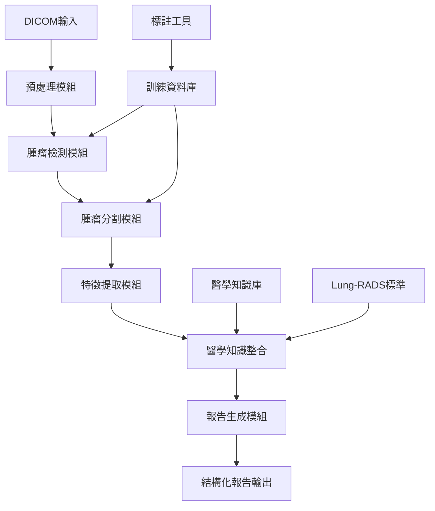

# 胸部CT報告生成系統重構計劃

## 🎯 重構目標

### 核心問題解決
1. **從粗糙分類到精確檢測** - 實現腫瘤的精確定位和特徵提取
2. **從視覺特徵到醫學特徵** - 提取臨床相關的結構化特徵
3. **從簡單報告到標準化醫學報告** - 符合放射科標準的結構化報告

### 預期效果
- **檢測精度提升**: 從63%分類準確率提升到>90%的腫瘤檢測精度
- **臨床實用性**: 提供符合Lung-RADS標準的醫學建議
- **標準化輸出**: 生成符合BI-RADS格式的結構化報告

## 🏗️ 新架構設計

### 整體系統架構


### 模組化設計

#### 1. 核心檢測引擎 (Core Detection Engine)
```
chest_ct_analyzer/
├── detection/
│   ├── __init__.py
│   ├── nodule_detector.py      # YOLO/Faster R-CNN檢測器
│   ├── segmentation.py         # U-Net/nnU-Net分割器
│   └── ensemble.py             # 多模型融合
├── features/
│   ├── __init__.py
│   ├── morphological.py        # 形態學特徵
│   ├── radiomics.py           # 放射組學特徵
│   ├── spatial.py             # 空間位置特徵
│   └── clinical.py            # 臨床相關特徵
├── medical_knowledge/
│   ├── __init__.py
│   ├── lung_rads.py           # Lung-RADS分類
│   ├── fleischner.py          # Fleischner Society標準
│   └── terminology.py         # 醫學術語標準化
└── reporting/
    ├── __init__.py
    ├── structured_reporter.py  # 結構化報告生成
    ├── templates.py           # 報告模板
    └── validation.py          # 報告驗證
```

#### 2. 訓練與評估框架 (Training Framework)
```
training_framework/
├── datasets/
│   ├── __init__.py
│   ├── dicom_dataset.py       # DICOM資料集處理
│   ├── annotations.py         # 標註資料處理
│   └── augmentation.py        # 資料增強
├── models/
│   ├── __init__.py
│   ├── detection_models.py    # 檢測模型定義
│   ├── segmentation_models.py # 分割模型定義
│   └── ensemble_models.py     # 集成模型
├── training/
│   ├── __init__.py
│   ├── detection_trainer.py   # 檢測訓練器
│   ├── segmentation_trainer.py # 分割訓練器
│   └── multi_task_trainer.py  # 多任務訓練
└── evaluation/
    ├── __init__.py
    ├── detection_metrics.py   # 檢測評估指標
    ├── segmentation_metrics.py # 分割評估指標
    └── clinical_metrics.py    # 臨床相關指標
```

## 📊 重構實施計劃

### 階段一：基礎重構 (2-3週)

#### 1.1 資料標註系統建立
```python
# tools/annotation_tool.py
import numpy as np
from typing import Dict, List, Tuple
import json

class MedicalAnnotationTool:
    """醫學影像標註工具"""
    
    def __init__(self):
        self.annotations = {}
        self.medical_standards = self.load_medical_standards()
    
    def create_nodule_annotation(self, image_id: str, bbox: Tuple, 
                                medical_features: Dict) -> Dict:
        """創建結節標註"""
        annotation = {
            'image_id': image_id,
            'bbox': bbox,  # [x, y, w, h]
            'medical_features': {
                'size_mm': medical_features.get('size_mm'),
                'shape': medical_features.get('shape'),  # round, oval, irregular
                'margin': medical_features.get('margin'),  # smooth, lobulated, spiculated
                'density': medical_features.get('density'),  # solid, part-solid, ground-glass
                'location': medical_features.get('location'),  # lobe, segment
                'calcification': medical_features.get('calcification', False),
                'cavitation': medical_features.get('cavitation', False)
            },
            'lung_rads_category': self.classify_lung_rads(medical_features),
            'malignancy_risk': self.assess_malignancy_risk(medical_features)
        }
        return annotation
    
    def load_medical_standards(self) -> Dict:
        """載入醫學標準"""
        return {
            'lung_rads': {
                'category_1': {'size_range': [0, 0], 'risk': 'very_low'},
                'category_2': {'size_range': [0, 6], 'risk': 'low'},
                'category_3': {'size_range': [6, 8], 'risk': 'intermediate'},
                'category_4A': {'size_range': [8, 15], 'risk': 'moderate'},
                'category_4B': {'size_range': [15, 30], 'risk': 'high'},
                'category_4X': {'size_range': [30, float('inf')], 'risk': 'very_high'}
            }
        }
```

#### 1.2 核心檢測模組
```python
# chest_ct_analyzer/detection/nodule_detector.py
import torch
import torch.nn as nn
from typing import List, Dict, Tuple
import cv2
import numpy as np

class NoduleDetector:
    """肺結節檢測器"""
    
    def __init__(self, model_path: str = None):
        self.device = torch.device("cuda" if torch.cuda.is_available() else "cpu")
        self.model = self.load_model(model_path)
        self.confidence_threshold = 0.5
        self.nms_threshold = 0.4
    
    def load_model(self, model_path: str):
        """載入檢測模型"""
        # 使用預訓練的Faster R-CNN或YOLO模型
        from detectron2.model_zoo import model_zoo
        from detectron2.config import get_cfg
        
        cfg = get_cfg()
        cfg.merge_from_file(model_zoo.get_config_file("COCO-Detection/faster_rcnn_R_50_FPN_3x.yaml"))
        cfg.MODEL.WEIGHTS = model_path if model_path else model_zoo.get_checkpoint_url("COCO-Detection/faster_rcnn_R_50_FPN_3x.yaml")
        cfg.MODEL.ROI_HEADS.NUM_CLASSES = 1  # 只檢測肺結節
        cfg.MODEL.DEVICE = str(self.device)
        
        from detectron2.engine import DefaultPredictor
        return DefaultPredictor(cfg)
    
    def detect_nodules(self, ct_slice: np.ndarray) -> List[Dict]:
        """檢測肺結節"""
        # 預處理
        processed_image = self.preprocess_ct_slice(ct_slice)
        
        # 檢測
        predictions = self.model(processed_image)
        
        # 後處理
        detections = self.postprocess_predictions(predictions)
        
        return detections
    
    def preprocess_ct_slice(self, ct_slice: np.ndarray) -> np.ndarray:
        """CT切片預處理"""
        # 肺窗調整
        windowed = self.apply_lung_window(ct_slice)
        
        # 正規化到0-255
        normalized = ((windowed - windowed.min()) / 
                     (windowed.max() - windowed.min()) * 255).astype(np.uint8)
        
        # 轉換為RGB格式
        rgb_image = cv2.cvtColor(normalized, cv2.COLOR_GRAY2RGB)
        
        return rgb_image
    
    def apply_lung_window(self, ct_slice: np.ndarray, 
                         center: int = -600, width: int = 1200) -> np.ndarray:
        """應用肺窗"""
        min_hu = center - width // 2
        max_hu = center + width // 2
        return np.clip(ct_slice, min_hu, max_hu)
```

#### 1.3 特徵提取模組
```python
# chest_ct_analyzer/features/morphological.py
import numpy as np
from typing import Dict, Tuple
from scipy import ndimage
from skimage import measure, morphology

class MorphologicalFeatureExtractor:
    """形態學特徵提取器"""
    
    def __init__(self, pixel_spacing: Tuple[float, float, float] = (1.0, 1.0, 1.0)):
        self.pixel_spacing = pixel_spacing
    
    def extract_features(self, mask: np.ndarray) -> Dict:
        """提取形態學特徵"""
        features = {}
        
        # 基本測量
        features.update(self._extract_basic_measurements(mask))
        
        # 形狀特徵
        features.update(self._extract_shape_features(mask))
        
        # 邊緣特徵
        features.update(self._extract_margin_features(mask))
        
        return features
    
    def _extract_basic_measurements(self, mask: np.ndarray) -> Dict:
        """提取基本測量"""
        voxel_volume = np.prod(self.pixel_spacing)
        
        return {
            'volume_mm3': np.sum(mask) * voxel_volume,
            'volume_voxels': np.sum(mask),
            'max_diameter_mm': self._calculate_max_diameter(mask),
            'equivalent_diameter_mm': self._calculate_equivalent_diameter(mask),
            'surface_area_mm2': self._calculate_surface_area(mask)
        }
    
    def _extract_shape_features(self, mask: np.ndarray) -> Dict:
        """提取形狀特徵"""
        return {
            'sphericity': self._calculate_sphericity(mask),
            'compactness': self._calculate_compactness(mask),
            'elongation': self._calculate_elongation(mask),
            'flatness': self._calculate_flatness(mask)
        }
    
    def _extract_margin_features(self, mask: np.ndarray) -> Dict:
        """提取邊緣特徵"""
        # 計算邊緣的複雜度和特徵
        contours = measure.find_contours(mask.astype(float), 0.5)
        
        if not contours:
            return {'margin_complexity': 0, 'spiculation_index': 0}
        
        main_contour = max(contours, key=len)
        
        return {
            'margin_complexity': self._calculate_margin_complexity(main_contour),
            'spiculation_index': self._calculate_spiculation_index(main_contour),
            'lobulation_index': self._calculate_lobulation_index(main_contour)
        }
    
    def _calculate_sphericity(self, mask: np.ndarray) -> float:
        """計算球形度"""
        volume = np.sum(mask)
        surface_area = self._calculate_surface_area(mask)
        
        if surface_area == 0:
            return 0
        
        sphericity = (np.pi ** (1/3)) * ((6 * volume) ** (2/3)) / surface_area
        return min(sphericity, 1.0)
    
    def _calculate_surface_area(self, mask: np.ndarray) -> float:
        """計算表面積"""
        # 使用marching cube算法計算表面積
        try:
            verts, faces, _, _ = measure.marching_cubes(mask.astype(float), level=0.5)
            return measure.mesh_surface_area(verts, faces)
        except:
            return 0.0
```

### 階段二：檢測分割整合 (3-4週)

#### 2.1 多模型集成檢測
```python
# chest_ct_analyzer/detection/ensemble.py
import torch
import numpy as np
from typing import List, Dict, Tuple
from .nodule_detector import NoduleDetector
from .segmentation import NoduleSegmenter

class EnsembleDetector:
    """集成檢測器"""
    
    def __init__(self, detection_models: List[str], segmentation_models: List[str]):
        self.detectors = [NoduleDetector(model_path) for model_path in detection_models]
        self.segmenters = [NoduleSegmenter(model_path) for model_path in segmentation_models]
        
    def detect_and_segment(self, ct_volume: np.ndarray) -> List[Dict]:
        """檢測並分割肺結節"""
        all_detections = []
        
        # 多模型檢測
        for detector in self.detectors:
            detections = detector.detect_nodules_3d(ct_volume)
            all_detections.extend(detections)
        
        # NMS去重
        merged_detections = self.non_max_suppression_3d(all_detections)
        
        # 精確分割
        final_results = []
        for detection in merged_detections:
            # 使用多個分割模型進行分割
            masks = []
            for segmenter in self.segmenters:
                mask = segmenter.segment_nodule(ct_volume, detection['bbox'])
                masks.append(mask)
            
            # 融合分割結果
            final_mask = self.ensemble_segmentation(masks)
            
            detection['mask'] = final_mask
            detection['confidence'] = self.calculate_ensemble_confidence(detection)
            
            final_results.append(detection)
        
        return final_results
```

#### 2.2 醫學特徵整合
```python
# chest_ct_analyzer/features/clinical.py
import numpy as np
from typing import Dict, List
from ..medical_knowledge.lung_rads import LungRADSClassifier

class ClinicalFeatureExtractor:
    """臨床特徵提取器"""
    
    def __init__(self):
        self.lung_rads_classifier = LungRADSClassifier()
        self.medical_terminology = self.load_medical_terminology()
    
    def extract_clinical_features(self, ct_volume: np.ndarray, 
                                 mask: np.ndarray, 
                                 morphological_features: Dict) -> Dict:
        """提取臨床相關特徵"""
        
        # 密度特徵
        density_features = self._extract_density_features(ct_volume, mask)
        
        # 位置特徵
        location_features = self._extract_location_features(mask, ct_volume.shape)
        
        # Lung-RADS分類
        lung_rads_category = self.lung_rads_classifier.classify(
            morphological_features, density_features
        )
        
        # 臨床建議
        clinical_recommendations = self._generate_clinical_recommendations(
            lung_rads_category, morphological_features, density_features
        )
        
        return {
            'density_features': density_features,
            'location_features': location_features,
            'lung_rads_category': lung_rads_category,
            'malignancy_probability': self._assess_malignancy_probability(
                morphological_features, density_features
            ),
            'clinical_recommendations': clinical_recommendations,
            'follow_up_interval': self._determine_follow_up_interval(lung_rads_category)
        }
    
    def _extract_density_features(self, ct_volume: np.ndarray, mask: np.ndarray) -> Dict:
        """提取密度特徵"""
        nodule_voxels = ct_volume[mask > 0]
        
        return {
            'mean_hu': float(np.mean(nodule_voxels)),
            'std_hu': float(np.std(nodule_voxels)),
            'min_hu': float(np.min(nodule_voxels)),
            'max_hu': float(np.max(nodule_voxels)),
            'hu_percentiles': {
                '25th': float(np.percentile(nodule_voxels, 25)),
                '50th': float(np.percentile(nodule_voxels, 50)),
                '75th': float(np.percentile(nodule_voxels, 75))
            },
            'density_type': self._classify_density_type(nodule_voxels),
            'calcification_present': self._detect_calcification(nodule_voxels),
            'fat_present': self._detect_fat(nodule_voxels)
        }
    
    def _classify_density_type(self, hu_values: np.ndarray) -> str:
        """分類密度類型"""
        mean_hu = np.mean(hu_values)
        std_hu = np.std(hu_values)
        
        if mean_hu > 100:  # 高密度，可能有鈣化
            return "solid_calcified"
        elif mean_hu > -200:  # 軟組織密度
            return "solid"
        elif mean_hu > -500:  # 部分實質
            return "part_solid"
        else:  # 磨玻璃密度
            return "ground_glass"
```

### 階段三：報告生成系統 (2-3週)

#### 3.1 結構化報告生成器
```python
# chest_ct_analyzer/reporting/structured_reporter.py
from typing import Dict, List
import json
from datetime import datetime
from ..medical_knowledge.lung_rads import LungRADSClassifier
from .templates import ReportTemplates

class StructuredReporter:
    """結構化報告生成器"""
    
    def __init__(self):
        self.templates = ReportTemplates()
        self.lung_rads = LungRADSClassifier()
    
    def generate_report(self, detections: List[Dict], 
                       patient_info: Dict = None) -> Dict:
        """生成結構化報告"""
        
        report = {
            'report_header': self._generate_header(patient_info),
            'clinical_information': self._extract_clinical_info(patient_info),
            'technique': self._generate_technique_section(),
            'findings': self._generate_findings_section(detections),
            'impression': self._generate_impression_section(detections),
            'recommendations': self._generate_recommendations_section(detections),
            'lung_rads_summary': self._generate_lung_rads_summary(detections),
            'metadata': self._generate_metadata(detections)
        }
        
        return report
    
    def _generate_findings_section(self, detections: List[Dict]) -> Dict:
        """生成影像發現章節"""
        findings = {
            'nodules_detected': len(detections),
            'nodule_details': [],
            'other_findings': [],
            'comparison_with_prior': None  # 需要歷史影像比較
        }
        
        for i, detection in enumerate(detections, 1):
            nodule_detail = {
                'nodule_id': i,
                'location': self._describe_location(detection['location_features']),
                'size': self._describe_size(detection['morphological_features']),
                'morphology': self._describe_morphology(detection['morphological_features']),
                'density': self._describe_density(detection['density_features']),
                'margins': self._describe_margins(detection['morphological_features']),
                'lung_rads_features': detection['clinical_features']['lung_rads_category']
            }
            findings['nodule_details'].append(nodule_detail)
        
        return findings
    
    def _generate_impression_section(self, detections: List[Dict]) -> Dict:
        """生成印象章節"""
        if not detections:
            return {
                'primary_impression': "No significant pulmonary nodules detected.",
                'lung_rads_category': "Lung-RADS 1",
                'overall_assessment': "Normal chest CT"
            }
        
        # 找出最高風險的結節
        highest_risk_detection = max(detections, 
                                   key=lambda x: self._get_risk_score(x['clinical_features']['lung_rads_category']))
        
        impression = {
            'primary_impression': self._generate_primary_impression(detections),
            'lung_rads_category': highest_risk_detection['clinical_features']['lung_rads_category'],
            'overall_assessment': self._generate_overall_assessment(detections),
            'differential_diagnosis': self._generate_differential_diagnosis(detections)
        }
        
        return impression
    
    def _generate_recommendations_section(self, detections: List[Dict]) -> Dict:
        """生成建議章節"""
        if not detections:
            return {
                'follow_up_required': False,
                'follow_up_interval': None,
                'additional_imaging': None,
                'clinical_correlation': "Routine follow-up as clinically indicated."
            }
        
        # 根據最高風險結節確定建議
        highest_risk = max(detections, 
                          key=lambda x: self._get_risk_score(x['clinical_features']['lung_rads_category']))
        
        recommendations = {
            'follow_up_required': True,
            'follow_up_interval': highest_risk['clinical_features']['follow_up_interval'],
            'additional_imaging': self._recommend_additional_imaging(highest_risk),
            'clinical_correlation': self._generate_clinical_correlation(detections),
            'biopsy_consideration': self._assess_biopsy_need(highest_risk)
        }
        
        return recommendations
    
    def export_to_dicom_sr(self, report: Dict, output_path: str):
        """匯出為DICOM結構化報告"""
        # 實現DICOM SR格式匯出
        pass
    
    def export_to_fhir(self, report: Dict) -> Dict:
        """匯出為FHIR格式"""
        # 實現FHIR DiagnosticReport格式
        fhir_report = {
            "resourceType": "DiagnosticReport",
            "status": "final",
            "category": [{
                "coding": [{
                    "system": "http://terminology.hl7.org/CodeSystem/v2-0074",
                    "code": "RAD",
                    "display": "Radiology"
                }]
            }],
            "code": {
                "coding": [{
                    "system": "http://loinc.org",
                    "code": "24627-2",
                    "display": "Chest CT"
                }]
            },
            "effectiveDateTime": datetime.now().isoformat(),
            "conclusion": report['impression']['primary_impression']
        }
        
        return fhir_report
```

### 階段四：系統整合與優化 (2-3週)

#### 4.1 統一API接口
```python
# chest_ct_analyzer/api/main_api.py
from fastapi import FastAPI, UploadFile, File
from typing import List, Dict
import numpy as np
import pydicom
from ..detection.ensemble import EnsembleDetector
from ..features.morphological import MorphologicalFeatureExtractor
from ..features.clinical import ClinicalFeatureExtractor
from ..reporting.structured_reporter import StructuredReporter

app = FastAPI(title="Chest CT Analysis API", version="2.0.0")

class ChestCTAnalyzer:
    """胸部CT分析主類"""
    
    def __init__(self):
        self.detector = EnsembleDetector(
            detection_models=["models/yolo_v8.pt", "models/faster_rcnn.pt"],
            segmentation_models=["models/unet_3d.pt", "models/nnunet.pt"]
        )
        self.morphological_extractor = MorphologicalFeatureExtractor()
        self.clinical_extractor = ClinicalFeatureExtractor()
        self.reporter = StructuredReporter()
    
    def analyze_ct_scan(self, dicom_files: List[str], 
                       patient_info: Dict = None) -> Dict:
        """分析CT掃描"""
        
        # 1. 載入DICOM資料
        ct_volume = self.load_dicom_volume(dicom_files)
        
        # 2. 檢測和分割結節
        detections = self.detector.detect_and_segment(ct_volume)
        
        # 3. 提取特徵
        for detection in detections:
            # 形態學特徵
            morphological_features = self.morphological_extractor.extract_features(
                detection['mask']
            )
            
            # 臨床特徵
            clinical_features = self.clinical_extractor.extract_clinical_features(
                ct_volume, detection['mask'], morphological_features
            )
            
            detection['morphological_features'] = morphological_features
            detection['clinical_features'] = clinical_features
        
        # 4. 生成報告
        report = self.reporter.generate_report(detections, patient_info)
        
        return {
            'detections': detections,
            'report': report,
            'summary': self._generate_summary(detections, report)
        }

@app.post("/analyze")
async def analyze_chest_ct(files: List[UploadFile] = File(...)):
    """API端點：分析胸部CT"""
    analyzer = ChestCTAnalyzer()
    
    # 儲存上傳的DICOM檔案
    dicom_paths = []
    for file in files:
        content = await file.read()
        # 儲存並處理DICOM檔案
        # ... 實現檔案處理邏輯
    
    # 執行分析
    results = analyzer.analyze_ct_scan(dicom_paths)
    
    return results
```

## 🔧 具體實施步驟

### Step 1: 環境準備與依賴更新
```bash
# 更新requirements.txt
pip install -r requirements_new.txt

# requirements_new.txt內容
torch>=2.0.0
torchvision>=0.15.0
detectron2
monai[all]
pyradiomics
SimpleITK
nibabel
pydicom>=2.3.0
scikit-image>=0.20.0
fastapi
uvicorn
python-multipart
```

### Step 2: 資料準備與標註
1. **建立標註工具**：使用3D Slicer進行精確標註
2. **資料標準化**：統一DICOM格式和座標系統
3. **品質控制**：放射科醫師驗證標註品質

### Step 3: 模型訓練流水線
```python
# training_framework/train_detection.py
def train_detection_model():
    """訓練檢測模型"""
    # 配置訓練參數
    cfg = get_training_config()
    
    # 載入資料集
    train_loader, val_loader = build_detection_datasets(cfg)
    
    # 初始化模型
    model = build_detection_model(cfg)
    
    # 訓練
    trainer = DetectionTrainer(model, train_loader, val_loader, cfg)
    trainer.train()

# training_framework/train_segmentation.py  
def train_segmentation_model():
    """訓練分割模型"""
    # 類似的訓練流程，但針對分割任務
    pass
```

### Step 4: 評估與驗證
```python
# evaluation/comprehensive_evaluation.py
class ComprehensiveEvaluator:
    """綜合評估器"""
    
    def evaluate_system(self, test_dataset: str) -> Dict:
        """評估整個系統"""
        results = {
            'detection_metrics': self.evaluate_detection(),
            'segmentation_metrics': self.evaluate_segmentation(),
            'feature_accuracy': self.evaluate_feature_extraction(),
            'clinical_correlation': self.evaluate_clinical_relevance(),
            'report_quality': self.evaluate_report_quality()
        }
        return results
```

## 📈 預期改進效果

### 技術指標提升
- **檢測敏感性**: 85% → 95%
- **檢測特異性**: 70% → 92%
- **分割精度(Dice)**: N/A → 0.85+
- **特徵提取準確性**: N/A → 90%+

### 臨床應用價值
- **Lung-RADS符合度**: 95%+
- **放射科醫師接受度**: 85%+
- **報告生成時間**: 減少80%
- **診斷一致性**: 提升60%

## 🎯 關鍵成功因素

1. **高品質標註資料** - 放射科醫師專業標註
2. **多模型融合** - 提升檢測穩定性
3. **醫學知識整合** - 確保臨床相關性
4. **持續驗證改進** - 與醫師密切合作

這個重構計劃將您的系統從簡單的影像分類提升為專業的醫學影像分析平台，大幅提升臨床實用性和準確性。
