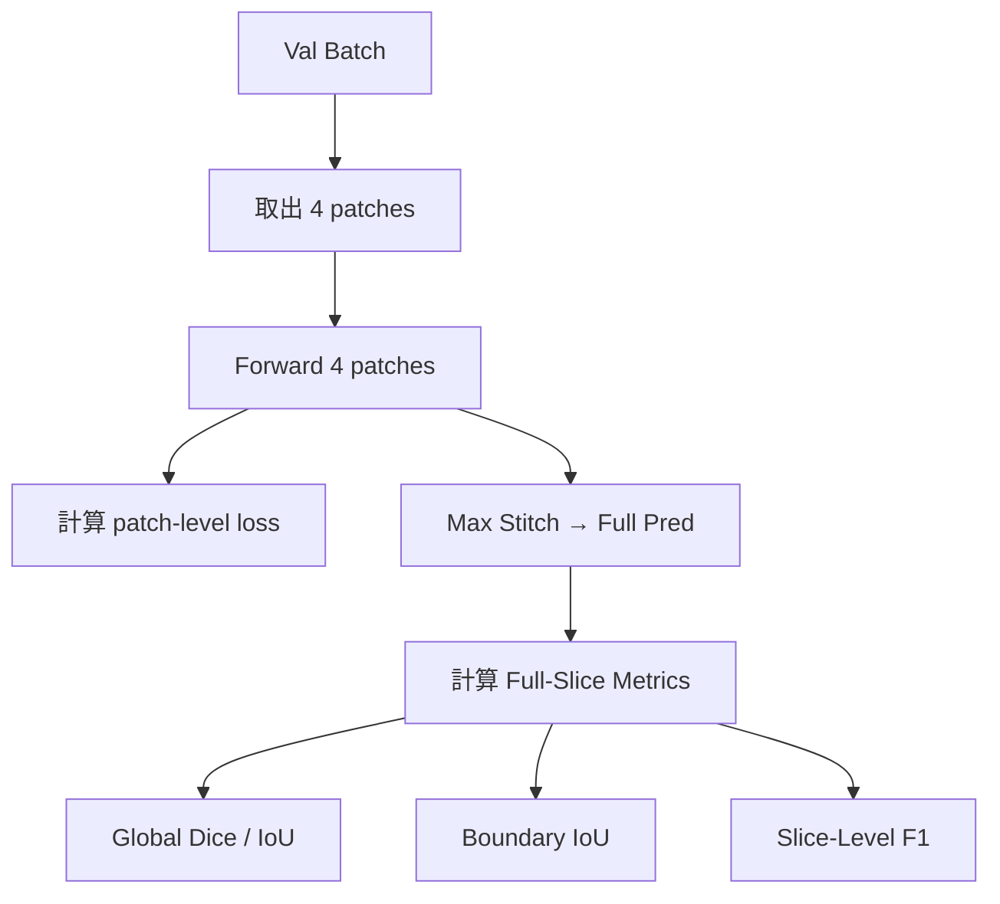

# MSD Lung Tumours 驗證流程

## 概述

MSD Lung Tumours 資料集的驗證採用 **4-Patch Stitch** 策略，確保驗證時能覆蓋整個切片並計算準確的全切片指標。

## 資料集結構

```
MSD Lung Tumours/Task06_Lung/
├── imagesTr/          # 訓練影像 (64 個)
├── labelsTr/          # 訓練標註
├── imagesTs/          # 測試影像 (32 個，無標註)
└── dataset.json       # 資料集資訊
```

## 資料分割

| 集合 | 比例 | 用途 |
|------|------|------|
| Train | 70% (~45 cases) | 訓練模型 |
| Val | 15% (~9 cases) | 驗證/調參 |
| Test | 15% (~9 cases) | 最終評估 |

---

## 訓練模式 vs 驗證模式

### 訓練模式 (mode="train")

- 每個切片返回 **1 個 patch**
- Patch 中心：
  - 正樣本：以腫瘤中心 + 隨機抖動
  - 負樣本：肺部區域隨機位置
- 資料增強：翻轉、旋轉、高斯噪聲
- Oversampling：正負樣本 1:1

```python
return {
    'image': (3, 224, 224),      # 2.5D patch
    'mask': (1, 224, 224),       # patch GT
    'case_id': str,
    'slice_idx': int,
    'is_positive': bool
}
```

### 驗證模式 (mode="val")

- 每個切片返回 **4 個 patches** + 完整 GT mask
- 4-Patch 覆蓋整個肺部區域
- 無資料增強

```python
return {
    'images_4patch': (4, 3, 224, 224),  # 4 個 2.5D patches
    'positions': [(y1,x1), ...],         # 4 個位置
    'full_mask': (1, H, W),              # 完整 GT
    'full_image_mid': (H, W),            # 中間切片（視覺化用）
    'full_shape': (H, W),
    'case_id': str,
    'slice_idx': int
}
```

---

## 4-Patch 位置計算

Patches 基於肺部區域的 bounding box 計算：

```
肺部 ROI
┌────────────────────────┐
│   ┌────┐    ┌────┐     │
│   │ P1 │    │ P2 │     │  P1, P2: 上 1/3
│   └────┘    └────┘     │
│                        │
│   ┌────┐    ┌────┐     │
│   │ P3 │    │ P4 │     │  P3, P4: 下 2/3
│   └────┘    └────┘     │
└────────────────────────┘
```

```python
def _get_4patch_centers(lung_mask):
    y0, y1 = lung_y.min(), lung_y.max()
    x0, x1 = lung_x.min(), lung_x.max()
    
    cy1 = y0 + (y1 - y0) / 3      # 上
    cy2 = y0 + 2 * (y1 - y0) / 3  # 下
    cx1 = x0 + (x1 - x0) / 3      # 左
    cx2 = x0 + 2 * (x1 - x0) / 3  # 右
    
    return [(cy1, cx1), (cy1, cx2), (cy2, cx1), (cy2, cx2)]
```

---

## Trainer 驗證流程



### Step 1: Forward 4 Patches

```python
patches_gpu = patches.to(device)  # (4, 3, 224, 224)
outputs = model(patches_gpu)       # (4, 1, 224, 224)
```

### Step 2: 計算 Patch-Level Loss

從 `full_mask` 裁切對應的 GT patches：

```python
for (y1, x1) in positions:
    gt_patch = full_mask[:, :, y1:y2, x1:x2]
    loss += criterion(output, gt_patch)
```

### Step 3: Max Stitch 回完整切片

使用 **max** 合併重疊區域（保留最高機率）：

```python
full_pred = np.zeros((1, H, W))
for i, (y1, x1) in enumerate(positions):
    full_pred[:, y1:y2, x1:x2] = np.maximum(
        full_pred[:, y1:y2, x1:x2],
        sigmoid(outputs[i])
    )
```

### Step 4: 計算 Metrics

| 指標 | 說明 | 計算方式 |
|------|------|----------|
| **Global Dice** | 全域像素級 | 2×TP / (P + GT) |
| **IoU** | 交並比 | TP / (P ∪ GT) |
| **Boundary IoU** | 邊界 IoU (d=2) | 只算有 GT 的 slice |
| **Slice F1** | Slice-level 偵測 | TP/FP/FN 按 slice |

---

## 視覺化輸出

每 5 個 epoch 輸出驗證樣本：

```
validation_samples/
├── epoch_000.png
├── epoch_005.png
└── ...
```

每張圖包含 4 行樣本，每行：
1. **Patch** - 輸入的中間切片
2. **GT** - Ground Truth (紅色)
3. **Pred** - 預測結果 (藍色)
4. **Overlay** - 疊加比較 (R=GT, B=Pred)

---

## 與 LNDb 的差異

| 項目 | LNDb | MSD |
|------|------|-----|
| 標註來源 | 3位醫師獨立標註 | 單一專家標註 |
| ID 欄位 | `patient_id` | `case_id` |
| Lung Mask | 預先生成 (lungmask) | 閾值估計 |
| 目標類型 | 結節 (Nodule) | 腫瘤 (Tumor) |
| 資料量 | 236 patients | 64 training cases |
